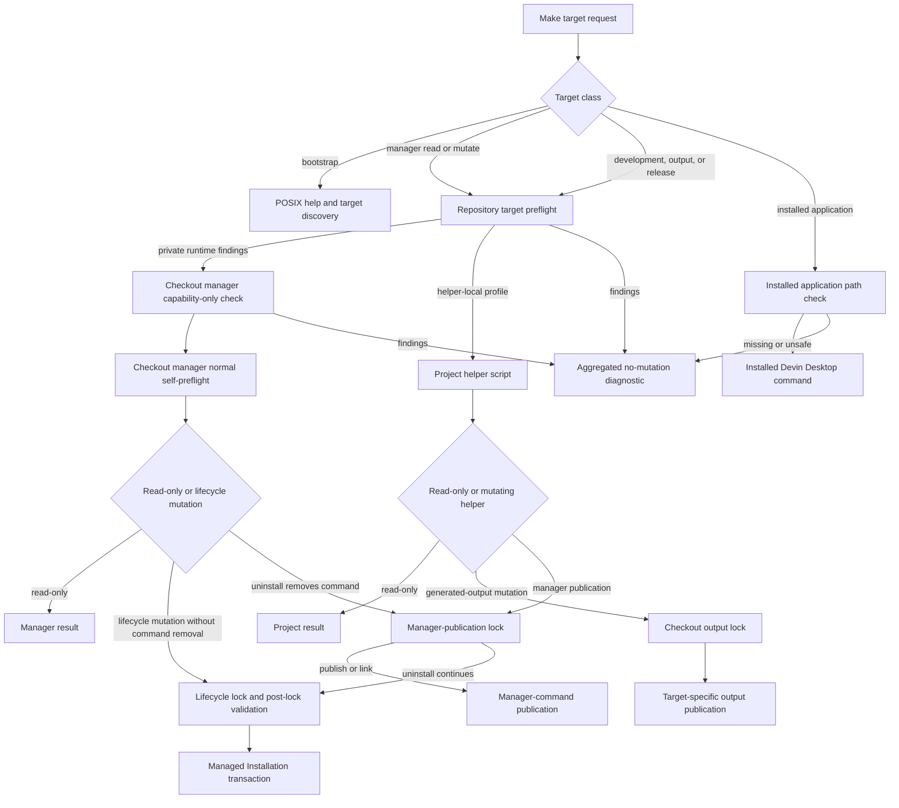
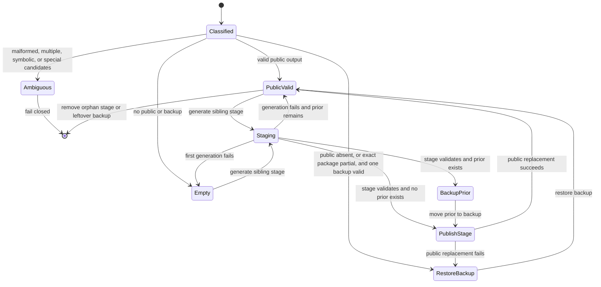
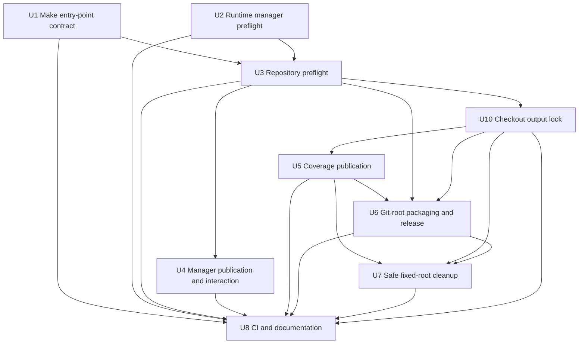

# Portable Make Command Experience - Plan

## Goal Capsule

- **Objective:** Make every repository Make target predictable from a clean checkout on supported native Linux hosts without requiring a previously installed Devin Desktop Manager or distro-specific bootstrap behavior.
- **Authority:** Preserve the Product Contract below, then the manager's existing ownership and transaction invariants, then existing target semantics and repository conventions.
- **Execution profile:** Deep, characterization-first hardening across Make routing, dependency discovery, mutation ordering, generated artifacts, CI, and documentation.
- **Stop conditions:** Stop for user direction if implementation would weaken Manager-Owned Root checks, make the installed manager depend on checkout files, change a public target's product outcome, or require support outside native glibc Linux x86_64.
- **Tail ownership:** The work is complete only when target behavior, automated evidence, CI, installation guidance, contributor guidance, and release guidance describe the same compatibility contract.
- **Workflow test:** `docs/user-workflows-test-plans/portable-make-commands-user-workflow-test.md`.
- **Issue workorder:** `docs/workorders/portable-make-commands-issues-workorder.md`.

---

## Product Contract

### Summary

This plan makes the repository's complete Make surface self-diagnosing and checkout-safe across supported Linux environments, with target-specific prerequisite checks, failure-before-mutation ordering, guarded paths, and deterministic evidence for repeated and interrupted operations.

### Problem Frame

The project currently works most reliably on a machine that already resembles the original development environment. Lifecycle targets default to `~/.local/bin/devin-desktop-manager`, so a clean checkout can fail before repository code explains the problem or can execute a stale installed manager against current state.

Dependency checks are fragmented and incomplete. Some commands are used before they are checked, command presence is treated as proof of GNU-specific behavior, development and release scripts have no shared preflight, and several targets delete or create data before discovering that a required tool or interaction mode is unavailable. This contradicts the installation documentation's promise to report missing requirements before making changes.

The result is both a developer-experience problem and a safety problem. The same uncertainty affects first-time users, maintainers, release automation, custom paths, noninteractive runs, and Linux systems whose command names exist but whose versions or capabilities differ.

### Actors

- A1. **Linux user or developer:** Clones or extracts the project and invokes lifecycle or development targets without prior machine-specific setup.
- A2. **Maintainer or releaser:** Runs deterministic coverage, packaging, and release checks while preserving known-good output on failure.
- A3. **CI automation:** Exercises supported tool floors and representative Linux userlands without prompts, live-service dependence, or duplicate full-suite execution.

### Requirements

**Make target and command identity**

- R1. Every `.PHONY` target in `Makefile`, including aliases and maintenance targets, has an explicit invocation, dependency, failure, and repeat-run contract covered by tests.
- R2. Manager-backed checkout routes always execute `bin/devin-desktop-manager`; installer-local `install-manager`, `link-dev`, and `link` publish checkout code directly, while composite `install` combines publication with checkout-manager update. The manager capability protocol remains private and in-tree, and the lifecycle-owned destination remains the canonical HOME-relative path.
- R3. Existing target outcomes and quality-gate ownership remain stable even when unsafe composite prerequisite edges are replaced by ordered orchestration: `verify` owns lint plus the plain full suite, while CI and release own lint plus one coverage-run full suite.
- R4. `help` remains available without an installed manager, `HOME`, Ruby tooling, desktop tools, or application state, and it identifies every callable target and alias.

**Prerequisites and environment**

- R5. Each target validates only the complete executable, feature, path, architecture, interaction, and environment capabilities it can reach.
- R6. A failed preflight aggregates all relevant missing and incompatible requirements, distinguishes blockers from optional capabilities, identifies the affected target, and exits without persistent mutation.
- R7. Capability checks validate required behavior or a documented minimum version rather than treating `command -v` success as compatibility.
- R8. Project commands never install host packages, invoke privilege escalation, or select package-manager-specific remediation; diagnostics point to distro-neutral installation guidance.
- R9. Native glibc Linux x86_64 on a local filesystem with working advisory `flock`, same-directory atomic rename, stable regular-file metadata, and same-device staging remains the supported platform. GNU Make must remain compatible with 4.3 behavior and Bash must be 4.4 or newer; higher tool floors are target-specific.

**Mutation and path safety**

- R10. Static eligibility checks complete before manager installation, lock or state-root creation, output replacement, or network access; race-sensitive state is revalidated after locking, and no public output changes when that revalidation fails.
- R11. The physical directory containing the primary `Makefile` is the immutable project root. Generated-output overrides are project-relative and must remain beneath that root after canonicalization; paths safely support printable spaces, quotes, glob characters, dollar signs, separators, and leading hyphens, while tabs, newlines, escape bytes, and other controls are rejected and safely displayed before mutation.
- R12. `uninstall` rejects non-TTY use before mutation, while `uninstall-yes` is the sole prompt-free Make contract and does not bypass prerequisites, ownership checks, or transaction safety.
- R13. Manager publication uses a HOME-derived, XDG-independent publication lock and same-directory atomic replacement. Coverage and package use target-specific project-local staging and backup rules that preserve prior accepted output on ordinary failure and deterministically repair a missing final from one valid backup after process interruption.
- R14. `clean` acquires the checkout output lock, validates both fixed project-local output roots before deleting either, removes only the characterized coverage tree and package-owned regular files, preserves unknown `dist/` siblings, rejects unsafe or ambiguous state, and succeeds when repeated.

**Source and verification portability**

- R15. `package` and `release-check` require a selected project root whose Git top-level exactly equals that root and which has a valid HEAD; an extracted release remains supported for help, installation, lifecycle, and applicable development targets, while release-engineering targets return an actionable Git-checkout diagnostic.
- R16. Offline Bats coverage proves clean-checkout, incomplete `PATH`, incompatible utilities, trusted executable identity, noninteractive and terminal behavior, path safety, ordinary output failures, legacy default outputs, repeat runs, mixed-version publication sequencing, and safe single-goal parallel execution.
- R17. CI keeps one canonical native Ubuntu full-suite coverage lane and adds focused non-root Debian-family and Fedora userland lanes plus a maintained minimum Bash/Make floor check without duplicating the full suite.
- R18. `README.md`, installation, support, contribution, security-maintainer, release, and pull-request guidance agree on target behavior, tool floors, generic remediation, and which gates run the full suite.
- R19. Public output is plain text and deterministic: results and help use stdout; warnings, errors, and prompts use stderr; direct commands use status 0 for success/no-op/user-decline, 1 for runtime/preflight/contention/partial failure, and 2 for usage; Make callers rely on zero versus nonzero because Make may normalize recipe statuses.
- R20. Bare `make` is `help`; unknown goals, invalid overrides, and more than one explicit top-level goal fail before recipes run. Legacy `MANAGER` and outside-project coverage/dist/package output are rejected with migration guidance, and release notes document these contract changes before enforcement.

### Key Flows

- F1. **Clean-checkout inspection**
  - **Trigger:** A1 invokes `help`, `status`, `check`, or `doctor` without a globally installed manager.
  - **Actors:** A1
  - **Steps:** Make resolves the checkout command, runs only the target's local preflight, and either executes repository code or returns one aggregated diagnostic before state creation.
  - **Outcome:** A stale or absent installed manager cannot control checkout behavior.
  - **Covered by:** R1, R2, R4-R10
- F2. **Mutating lifecycle command**
  - **Trigger:** A1 invokes `install`, `install-manager`, `link-dev`, `update`, `rollback`, `set-defaults`, or an uninstall target.
  - **Actors:** A1
  - **Steps:** The full local capability and path contract is checked, interaction authorization is established when required, the relevant lock is acquired, race-sensitive state is revalidated, and existing transaction logic performs the mutation.
  - **Outcome:** Locally predictable failures leave no persistent changes; runtime failures leave only documented recoverable state.
  - **Covered by:** R2, R5-R14
- F3. **Development quality gate**
  - **Trigger:** A1 or A3 invokes `test`, `lint`, `coverage`, or `verify`.
  - **Actors:** A1, A3
  - **Steps:** Target-specific development tools are validated, test state is isolated, and generated evidence is published only after freshness and threshold checks pass.
  - **Outcome:** Gates run the intended suite count and do not depend on stale output or unrelated runtime tools.
  - **Covered by:** R1, R3, R5-R9, R13, R16-R18
- F4. **Package and release validation**
  - **Trigger:** A2 or A3 invokes `package` or `release-check` from an exact-root Git checkout.
  - **Actors:** A2, A3
  - **Steps:** The immutable project root and exact Git top-level are resolved, the complete release capability set is checked, deterministic archive/checksum output is staged and validated, and target-specific backup/publication rules publish the pair under the checkout output lock.
  - **Outcome:** Repeat output is byte-identical, ordinary failures preserve the prior pair, and extracted sources fail before output mutation with the required Git-checkout guidance.
  - **Covered by:** R3, R5-R9, R13-R18
- F5. **Cleanup or noninteractive uninstall**
  - **Trigger:** A1 or A3 invokes `clean`, `uninstall`, or `uninstall-yes`.
  - **Actors:** A1, A3
  - **Steps:** Consent and ownership are checked before mutation; publication-before-lifecycle locking protects manager removal; clean validates fixed project-local coverage and distribution candidates under the checkout output lock before removing either.
  - **Outcome:** Automation is prompt-free only through the explicit target and cleanup cannot delete foreign data.
  - **Covered by:** R10-R14, R16

### Acceptance Examples

- AE1. **Checkout wins over stale install:** Given a clean checkout and a sentinel executable at the default installed-manager path, when `make status` runs, then the checkout manager runs and the sentinel is untouched.
- AE2. **Complete no-mutation diagnostic:** Given several missing target requirements, when a mutating target runs, then one ordered diagnostic lists every relevant blocker and no manager, lock, XDG, coverage, or distribution path is created or changed.
- AE3. **Capability mismatch is distinct:** Given a command name that resolves but lacks a required GNU option or semantic, when its dependent target runs, then preflight reports the incompatible capability rather than treating the tool as present.
- AE4. **Path variation is semantic only:** Given checkout, HOME, XDG, executable, coverage, and distribution paths containing accepted printable shell metacharacters, when supported targets run, then values are transported as data rather than recipe source; paths with tabs, newlines, or escape bytes fail with bounded single-line escaped diagnostics.
- AE5. **Known-good artifacts survive ordinary failure:** Given a valid prior coverage report or package/checksum pair, when generation, validation, or handled publication fails, then the prior public output remains byte-identical; after untrapped process death, one valid final wins, one valid backup repairs a missing final, orphan staging is discarded, and multiple or malformed candidates fail closed.
- AE6. **Automation never implies consent:** Given non-TTY stdin, when `make uninstall` runs, then it fails before lock or state creation and points to `uninstall-yes`; when `uninstall-yes` runs, it never reads stdin and still enforces all safety checks.
- AE7. **Cleanup fails closed:** Given an unsafe coverage shape, symlink, special file, escaping override, malformed backup, or package candidate whose identity does not match its checksum, when `make clean` runs, then neither output set changes; a valid `dist/keep.txt` is preserved while only package-owned files are removed after all candidates validate.
- AE8. **Release source is unambiguous:** Given a project nested inside an unrelated parent Git repository or an authenticated extracted release without `.git`, when `make package` or `make release-check` runs, then exact-root validation rejects it before output mutation; help and lifecycle targets continue to use checkout/extracted source without requiring Git where their profiles do not reach it.
- AE9. **Command entry is deterministic:** Given bare `make`, an unknown goal, an invalid override, duplicate explicit goals, or two different top-level goals with or without `-j`, then only bare `make` proceeds to help; every invalid or multi-goal form returns usage failure before any recipe mutation.
- AE10. **Upgrade bridges current locking:** Given the current released manager is uninstalling under its existing lifecycle lock, when the new checkout publishes the manager command, then publication fails fast with direct status 1/Make nonzero before replacement; retry acquires publication then current/legacy lifecycle locks and never loses the canonical command.

### Success Criteria

- A fresh supported Linux checkout can run every target to either its intended outcome or an actionable target-specific diagnostic without a preinstalled manager.
- No local prerequisite, compatibility, path, root-user, or interaction failure occurs after persistent mutation begins.
- Every target's missing and incompatible-tool behavior is deterministic and covered offline.
- Coverage, package, checksum, cleanup, and manager-command operations preserve prior accepted state on ordinary failure and follow explicit bounded repair rules after process death.
- Bare, invalid, multi-goal, interactive, noninteractive, busy, no-op, partial-success, and retry outcomes have stable streams, statuses, and user guidance.
- The canonical and focused compatibility CI lanes prove the documented Bash, Make, representative userland, and non-root contracts while each required gate runs the full suite only once.
- User and maintainer documentation no longer assumes `yay`, `apt`, `dnf`, or another package manager is available.

### Scope Boundaries

**In scope**

- All 22 current `.PHONY` targets in `Makefile`, their shared scripts, and direct script invocation where it shares the same safety contract.
- Native glibc Linux x86_64 userlands with GNU command capabilities that meet the documented target-specific contract.
- Checkout and authenticated extracted-source lifecycle use, user-local installation, development quality gates, Git-root deterministic packaging, release validation, cleanup, and focused CI compatibility evidence.

**Out of scope**

- macOS, Windows, WSL, musl-only distributions, non-x86_64 systems, system-wide installation, and distro package publication.
- Automatic package installation, package-manager detection in project commands, container-only development as the required user experience, or weakening feature checks to accommodate incompatible utilities.
- Rewriting the Bash manager or Make surface in another build system, changing the Managed Installation ownership model, or changing application lifecycle outcomes unrelated to preflight and failure ordering.
- Power-loss durability, hostile same-UID processes or caller-controlled trusted startup configuration, network filesystems, and transparent support for tabs/newline/control-character paths; process failure and cooperative concurrency on validated local filesystems remain covered.

#### Deferred to Follow-Up Work

- Self-hosted multi-distribution VM coverage for desktop sessions, user namespaces, NFS/CIFS lock semantics, and kernel-policy behavior beyond the canonical Ubuntu runner.
- Machine-readable preflight output or a general dry-run interface unless a concrete automation consumer appears.
- Generic generated-output transaction metadata, arbitrary absolute output roots, cross-checkout output coordination, extracted-source repackaging, a public manager-protocol override, exhaustive Arch/rolling-distribution CI, and manager command publication outside the canonical lifecycle path.

---

## Planning Contract

### Key Technical Decisions

| ID | Decision | Rationale |
|---|---|---|
| KTD1 | Override Make's recipe shell to literal `/bin/sh`, pin shell flags, transport caller-controlled values through exported environment variables rather than recipe text, and invoke one absolute resolved Bash pathname after neutralizing project-controlled startup hooks. | Direct Make expansion inside quoted recipe syntax is still injectable when a value contains quotes, backticks, or `$()`. `MAKEFILES` and hostile same-UID startup configuration remain caller trust boundaries; Make entry points provide the sanitized contract. |
| KTD2 | Fix manager execution to `bin/devin-desktop-manager` and manager publication to the canonical HOME-relative destination; reject legacy `MANAGER` Make assignments with migration guidance and expose no replacement manager override. | No actor requires an external manager implementation. Removing the protocol extension avoids ambiguous source identity and keeps the private capability channel in-tree. |
| KTD3 | Use two preflight owners joined by an internal finding protocol named and versioned within `bin/devin-desktop-manager`: repository preflight owns target mapping, helper capabilities, selected-root policy, and ordered unions; manager preflight owns runtime/HOME/XDG/root/TTY profiles. | Human-output scraping and duplicate capability lists would drift. The private interface uses fixed profile identifiers, NUL-safe bounded records, and direct statuses 0 compatible, 1 findings, and 2 usage, but is not a supported external API. |
| KTD4 | Define helper-local capability profiles for each callable operation and ordered composite Make profiles as unions of their reachable children. | `scripts/check-coverage` does not need the full coverage runner toolchain, and `scripts/release-check` does not itself lint or package. One registry may be evaluated more than once, but policy definitions must not be duplicated or broadened beyond reachability. |
| KTD5 | Treat GNU Make 4.3 and Bash 4.4 as compatibility baselines; use numeric floors only where upstream history is stable, and run behavioral probes with closed stdin, timeout/output bounds, isolated temporary state, neutralized tool configuration, and no network. | A selected executable is caller-trusted, but probes must not inherit ambient config or hang. Curl uses `--disable` first, retains TLS verification, and applies explicit redirect, proxy/CA, credential, response-size, and timeout policy. |
| KTD6 | Reject more than one explicit top-level Make goal, replace unsafe composite prerequisite edges with ordered single-goal orchestrators, and bridge manager upgrades with publication-before-current/legacy-lifecycle lock ordering. | Per-invocation multi-goal union preflight would add a second scheduler. Holding validated current/legacy lifecycle descriptors through publication and application update prevents a current released manager from racing first publication. |
| KTD7 | Constrain `COVERAGE_DIR` and `DIST_DIR` to project-relative roots and use one checkout-local output lock plus target-specific sibling stage/backup/final rules. | Coverage is an exclusive generated tree, while `dist/` is a shared container whose unknown siblings must survive. Target-specific recovery handles ordinary and process failures without a generic persisted transaction framework. |
| KTD8 | Make clean validate both output candidates before deleting either; recursively remove coverage only after exact legacy/current layout validation, and remove only package-owned regular files from `dist/` before `rmdir` when empty. | Fixed project-local roots and known file sets provide safe cleanup without claiming arbitrary directories or absorbing foreign entries. |
| KTD9 | Preserve quality-gate semantics and one-suite ownership rather than making `verify` coverage-enforcing. | The repository learning in `docs/solutions/best-practices/behavior-preserving-simplification-for-security-sensitive-bash.md` established that CI and release use coverage as the single full-suite owner to avoid duplicate work; portability does not require changing the public gate's outcome. |
| KTD10 | Require exact-root Git with HEAD for package and release checks; preserve working-tree packaging for local `package`, while official release mode requires a clean tree and content bound to the workflow commit/tag. | This preserves current developer behavior and prevents parent-repository discovery or dirty official artifacts without introducing extracted-source repackaging metadata. |
| KTD11 | Layer CI evidence: native Ubuntu 24.04 owns lint plus the full coverage suite; digest-pinned Debian-family and Fedora non-root lanes run a focused preflight/Make/manager-capability smoke suite; a maintained fixture proves the Bash/Make floor. | Representative userspace variation is required, but duplicate full suites and an exhaustive rolling-distro matrix do not improve the initial portability contract proportionally. |

### Interface and Ownership Contract

| Interface | Contract | Owner |
|---|---|---|
| Checkout manager | Always the absolute `bin/devin-desktop-manager` beneath the physical project root. It is not overridable from Make. The old `MANAGER` assignment fails at parse time with migration guidance. | U1, U2 |
| Lifecycle manager destination | Always derives from the validated absolute HOME as `~/.local/bin/devin-desktop-manager`; Make lifecycle targets do not override it. A custom destination passed directly to `scripts/install-manager` is caller-owned and is not removed by manager uninstall. | U1, U4 |
| `APP` | One exact executable pathname for `run` and `app-version`; it does not alter Managed Installation links or desktop integration. | U1 |
| `BASH`, `BATS`, `SHELLCHECK`, `BASHCOV` | One executable name or absolute pathname, never a shell fragment. Resolution excludes aliases, functions, builtins, relative/empty PATH entries, records one absolute regular executable, and uses that exact path for probe and execution. | U1, U3, U5 |
| `DIST_DIR`, `COVERAGE_DIR` | Defaults to `dist/` and `coverage/`; overrides are project-relative, canonicalize beneath the physical project root, and may not be equal, nested, symbolic, or absolute. | U5-U7 |
| Selected project root | One immutable physical root derived from the primary `Makefile` location and passed to preflight, lint, coverage, Git validation, release checks, and packaging. | U1, U3, U5, U6 |

The manager capability-only interface is private `internal-preflight 1 COMMAND`, where `COMMAND` is exactly `status`, `check`, `update`, `rollback`, `set-defaults`, `doctor`, `uninstall`, or `uninstall-yes`; `install` maps to `update`, and only the manager composes lower-level capability groups. Stdout is byte-exact `DDM-PREFLIGHT\0` + `1\0` + decimal record count + `\0`, followed by six NUL-terminated fields per record: severity, category, capability key, purpose, observed value, and remediation; stdout ends immediately after the count NUL for zero records or the final remediation NUL otherwise. Severity is `blocker` or `warning`; category is `environment`, `path`, `platform`, `command`, `interaction`, or `optional`; capability keys are ASCII `[a-z0-9.-]{1,64}`. At most 64 records, 512 input bytes per text field, and 32768 total bytes including header are accepted. Findings return 1 with records on stdout and empty stderr; compatible returns 0 with a zero-count header; usage, malformed, truncated, extra, enum-invalid, or oversized data returns 2 on stderr with empty stdout. `scripts/preflight` converts a manager protocol failure to one target-scoped blocker. Public machine-readable diagnostics remain deferred.

The manager-publication lock is `$HOME/.local/bin/.devin-desktop-manager.publication.lock`, adjacent to but distinct from the canonical command and outside every uninstall-cleanable root. Its parent must be current-UID owned, non-symbolic, and not group/world writable; the opened lock is revalidated before and after acquisition. Canonical orchestration uses fixed private descriptors 9 publication, 8 current lifecycle, and optional 7 shipped-legacy lifecycle. `scripts/install-manager --canonical --publication-lock-fd 9 --lifecycle-lock-fd 8 [--legacy-lock-fd 7] SOURCE DESTINATION` and `bin/devin-desktop-manager --publication-lock-fd 9 --lifecycle-lock-fd 8 [--legacy-lock-fd 7] COMMAND` first call nonblocking `flock` on each inherited descriptor, then validate descriptor class, expected path, device/inode, UID, type, link count, and lifetime through the application transaction; matching an unlocked inode alone never authorizes the operation. Direct canonical publication acquires all applicable locks itself; an absent legacy lock omits descriptor 7; custom direct destinations use atomic replacement only and are outside this protocol. Contention always fails fast with direct status 1; old binaries started with divergent HOME/XDG state remain outside the cooperative boundary.

| Policy boundary | Owns | Must not own |
|---|---|---|
| Repository preflight | Make target classification, ordered composite unions, helper/output capabilities, executable resolution, selected root, and aggregate rendering. | Manager HOME/XDG/root/TTY predicates, runtime capabilities, lifecycle state, or post-lock race decisions. |
| Manager preflight | Runtime command groups, HOME/XDG/root/TTY policy, architecture/glibc, application state prerequisites, and runtime remediation meaning. | Development, Ruby, lint, coverage, or package capabilities. |
| Direct helper | Only capabilities reachable by that helper after Bash launches. | Its composite Make target's unrelated children. |
| Mutator | Lock acquisition, opened-object identity checks, post-lock revalidation, target-specific stage/backup repair, and public replacement. | Pre-lock assumptions about current filesystem identity. |

### Helper Contract Matrix

| Helper | Visibility and invocation | Profile / root | Status and first effect | Primary owner / test |
|---|---|---|---|---|
| `bin/devin-desktop-manager` | Public CLI plus private lock-FD options before `COMMAND`; private `internal-preflight 1 COMMAND` | Manager-owned command profile; HOME/XDG lifecycle root | 0/1/2, or 130 on direct prompt SIGINT; command effect only after self-preflight | U2 primary, U4 lock integration / `tests/manager.bats` |
| `scripts/preflight` | Internal `PROFILE [--project-root ROOT]` | Sole registry; root optional only for allowlisted `install-manager`, `check-coverage`, `fixture-mini-deb` profiles and required otherwise | 0 compatible, 1 findings, 2 usage; no persistent effect | U3 / `tests/preflight.bats` |
| `scripts/install-manager` | Maintainer helper `[--link] [canonical lock-FD options] SOURCE DESTINATION` | Root-independent `install-manager`; explicit paths; custom destination caller-owned | 0/1/2; canonical locks or custom atomic parent/temp/final replacement | U4 / `tests/makefile.bats` |
| `scripts/check-coverage` | Direct `RESULTSET MINIMUM_PERCENT` | `check-coverage`; no project-root discovery | 0/1/2; read-only result validation | U5 / `tests/coverage.bats` |
| `scripts/output-lock` | Private `PROJECT_ROOT -- HELPER [ARGS]` for an allowlisted in-tree output helper | `output-lock`; physical root required | Child status or 2 usage; opens/locks fixed FD 6 and injects `--output-lock-fd 6`; child re-flocks nonblocking then revalidates | U10 / `tests/output-lock.bats` |
| `scripts/run-coverage` | Internal `[--output-lock-fd 6] --project-root ROOT` | `coverage-run`; explicit physical root | 0/1/2; without FD re-execs through U10, then repair/stage/publication | U5 / `tests/coverage.bats` |
| `scripts/lib/coverage-output.bash` | Source-only `coverage_classify`, `coverage_repair`, `coverage_removal_set` | Canonical coverage root argument | Pure classify, then target-specific repair/removal under validated FD 6 | U5 primary, U7 consume-only / `tests/coverage.bats` |
| `scripts/package-release` | Direct `[--project-root ROOT] [--release-mode TAG COMMIT] [--output-lock-fd 6] VERSION OUTPUT_DIRECTORY` | `package`; omitted root defaults to physical script root; output must canonicalize beneath it | 0/1/2; without FD re-execs through U10, then pair repair/stage/publication | U6 / `tests/release-check.bats` |
| `scripts/lib/package-output.bash` | Source-only `package_classify`, `package_repair`, `package_removal_set` | Canonical dist root argument | Pure classify, then target-specific repair/removal under validated FD 6 | U6 primary, U7 consume-only / `tests/release-check.bats` |
| `scripts/release-check` | Direct `[--project-root ROOT] [--release-tag TAG] VERSION` | `release-contract`; omitted root defaults to physical script root, then exact Git root | 0/1/2; read-only contract checks | U6 / `tests/release-check.bats` |
| `scripts/clean-generated` | Internal `[--output-lock-fd 6] --project-root ROOT` | `clean`; explicit root and canonical coverage/dist | 0/1/2; without FD re-execs through U10, then classify/repair/reclassify/remove | U7 / `tests/makefile.bats` |
| `tests/fixtures/build-mini-deb` | Test-only `OUTPUT [safe|unsafe-symlink|unsafe-hardlink|control-no-dot] [BUILD] [VERSION]` | `fixture-mini-deb`; root-independent explicit output | 0/1/2; creates only the disposable fixture output | U3 profile, U2 tests consume / `tests/manager.bats` |

Existing direct helper syntax remains compatible except that package output must remain beneath its physical project root; U8 documents that output-root migration. Later units register new profile keys in `scripts/preflight`; they consume but do not redesign its record grammar or output policy. An output helper that receives FD 6 without a matching open lock descriptor fails status 2; no environment value alone authorizes locked behavior.

### File Ownership Contract

| File or domain | Primary editor | Permitted downstream change | Consume/integration owner |
|---|---|---|---|
| `Makefile`, target graph, recipe data transport | U1 | U3-U8 may replace only their target recipe body/profile reference | `tests/makefile.bats` integrates all units |
| `bin/devin-desktop-manager`, private records, command profiles | U2 | U4 adds only private lock-FD parsing/validation and interaction ordering | U8 focused manager tags consume |
| `scripts/preflight`, record renderer, profile registry | U3 | U4-U7 register named profile references without changing grammar/renderer | `tests/preflight.bats` |
| `scripts/install-manager`, manager lock protocol | U4 | None | `tests/makefile.bats`, `tests/manager.bats` |
| `scripts/output-lock`, FD 6 transport | U10 | None | U5-U7 consume; `tests/output-lock.bats` owns lock mechanics only |
| `scripts/run-coverage`, `scripts/lib/coverage-output.bash`, `.simplecov`, threshold integration | U5 | U7 sources documented classify/repair/removal functions without editing them | `tests/coverage.bats` |
| `scripts/package-release`, `scripts/release-check`, `scripts/lib/package-output.bash` | U6 | U7 sources documented classify/repair/removal functions without editing them | `tests/release-check.bats`; package behavior does not live in `tests/makefile.bats` |
| `scripts/clean-generated` | U7 | None | `tests/makefile.bats` plus domain fixtures from coverage/release suites |
| `tests/helpers/portable.bash` | U3 | U4-U7 add domain fixtures through its stable shim/barrier/snapshot/path-corpus API | Focused Bats suites consume |
| `tests/run-portability-smoke`, `tests/fixtures/portability-userland.Dockerfile`, and compatibility job contract | U8 | None | CI jobs `portable-debian`, `portable-fedora`, `portable-minimum-toolchain` |
| Workflows, public documentation, changelog, companion artifact policy | U8 | None | `tests/repository.bats` |

### Target-Specific Output API

The source-only `coverage-output.bash` and `package-output.bash` libraries expose the same transport, not the same policy. `*_classify ROOT` writes exactly `STATE\0REASON\0`: safe states return 0 and are `absent`, `public-valid`, `repair-backup`, `discard-stage`, or `public-valid-cleanup`; package additionally allows `repair-partial`. Unsafe state returns 1 as `unsafe\0REASON\0`; usage returns 2 with empty stdout. Stable reason keys are `invalid-public`, `multiple-stage`, `multiple-backup`, `symbolic`, `special`, `hard-linked`, `wrong-device`, `outside-root`, `checksum-mismatch`, and `unknown-coverage-entry`.

`*_repair ROOT EXPECTED_STATE` requires validated/locked FD 6, reclassifies, and mutates only when the current state exactly equals the expected safe repair state. It returns 0 with empty stdout, 1 if state changed/became unsafe, and 2 for usage. `*_removal_set ROOT` requires post-repair `absent` or `public-valid`, writes a raw-byte-sorted NUL-terminated list of absolute paths and returns 0, returns 1 with empty stdout for unsafe/repairable state, and 2 for usage. U7 captures both initial classification records before calling either repair function.

### Canonical Path Corpus

The reusable accepted component strings are exactly `plain`, `space dir`, `single-'quote`, `double-"quote`, `glob-[*?]`, `dollar-$value`, `subshell-$(touch sentinel)`, `semi-;amp-&pipe-|`, `--leading`, and the byte sequence `backtick-` + `0x60` + `touch sentinel` + `0x60`. The executable rejected corpus is empty required value, `../escape`, absolute values where project-relative is required, one literal tab, LF, CR, ESC, every other byte `0x01-0x1f`, and DEL `0x7f`, plus symlinked root, equal coverage/dist roots, and either root nested beneath the other. NUL is structurally unrepresentable in a POSIX pathname/argument/environment value and is N/A, not a runnable fixture. Tests create a sentinel proving accepted shell-looking strings are never executed.

| Interface | Accepted corpus application | Additional rejection |
|---|---|---|
| Physical checkout root, HOME, TMPDIR | Every accepted component in the parent/root path | Control corpus, symlinked root, ambiguous physical identity |
| `XDG_CONFIG_HOME`, `XDG_DATA_HOME`, `XDG_STATE_HOME`, `XDG_CACHE_HOME`, `XDG_RUNTIME_DIR` | Every accepted component as an absolute root | Relative, symbolic, wrong-owner, unsafe runtime permissions |
| `APP`, `BASH`, `BATS`, `SHELLCHECK`, `BASHCOV` | Every accepted component in one absolute executable pathname | Shell fragment, non-regular/non-executable, relative/empty PATH resolution |
| Canonical manager command/lock | Inherits every accepted HOME component | Independent destination override, removable/symbolic/insecure lock parent |
| Direct `scripts/install-manager` source/destination | Every accepted component in explicit absolute paths | Unsafe destination type/parent; custom destination remains caller-owned |
| `COVERAGE_DIR`, `DIST_DIR`, package output | Every accepted project-relative component | Absolute, escaping, symbolic, equal/nested, outside physical root |

### Test Harness Contract

`tests/helpers/portable.bash` is sourced only by Bats and owns cleanup through `BATS_TEST_TMPDIR`. `PORTABLE_TEST_TIMEOUT` defaults to 10 seconds. `resolve_harness_tools NAME...` resolves absolute regular executable paths before SUT PATH changes, stores them in associative array `HARNESS_TOOLS[NAME]`, and returns 0 or 1 with one stderr error and no partial array on failure.

`make_command_shim NAME REAL LOG BEHAVIOR` creates and prints one absolute shim under `BATS_TEST_TMPDIR/bin`. `BEHAVIOR` is exactly `pass`, `fail:N:STATUS`, or `pause:N:READY:CONTINUE`; call numbers start at 1. Each call appends `call\0N\0ARGC\0` followed by each argument plus NUL. Pause atomically creates `READY`, waits at most `PORTABLE_TEST_TIMEOUT` for `CONTINUE`, then delegates; timeout leaves READY/CONTINUE evidence untouched, never invokes REAL, writes one stderr timeout line, and returns 124. Fail exits `STATUS`; pass delegates immediately. `wait_for_ready PATH [SECONDS]` uses `PORTABLE_TEST_TIMEOUT` when SECONDS is omitted and returns 0 when a regular ready file appears or 1 on bounded timeout. `release_barrier PATH` atomically creates a mode-0600 regular continue file and returns 0/1.

`snapshot_tree ROOT OUTPUT` writes raw-byte-sorted NUL records `relative-path\0type\0mode\0link-count\0device\0inode\0sha256-or-link-target\0`, never follows symlinks, and returns 0/1. The helper exports indexed arrays `PORTABLE_ACCEPTED_COMPONENTS` and `PORTABLE_REJECTED_CASES` matching the Canonical Path Corpus. Functions return 2 for invalid arguments and never write outside `BATS_TEST_TMPDIR` except read-only snapshot traversal of the explicit root.

### Target Contract Matrix

| Target | Route and profile | First mutation or external effect | Repeat contract | Primary owner / focused test |
|---|---|---|---|---|
| `help` | POSIX bootstrap; no project profile | stdout only | Identical discovery output | U1 / `tests/makefile.bats` |
| `link` | Alias of ordered `link-dev` | Manager-publication lock, then symlink publication | Replaces only owned development link | U1, U4 / `tests/makefile.bats` |
| `install` | Ordered union: manager publication plus runtime update | Manager-publication lock, then canonical manager publication after complete local preflight | Retry uses the same destination; manager-only partial state is resumable | U3, U4 / `tests/makefile.bats`, `tests/manager.bats` |
| `install-manager` | Installer-local profile | Manager-publication lock, then canonical publication | Atomic replacement of owned destination | U4 / `tests/makefile.bats` |
| `status` | Checkout manager read-only profile | None | Stable inspection | U1, U2 / `tests/makefile.bats`, `tests/manager.bats` |
| `check` | Checkout manager manifest profile | Network request only | Fresh read-only check | U1, U2 / `tests/makefile.bats`, `tests/manager.bats` |
| `update` | Checkout manager mutation profile | Manager state/download transaction after lifecycle lock | Safe refresh/resume | U2, U4 / `tests/manager.bats` |
| `rollback` | Checkout manager release-mutation profile | Current/previous release transaction | Intentional current/previous toggle | U2, U4 / `tests/manager.bats` |
| `set-defaults` | Checkout manager integration-mutation profile | Desktop/MIME integration update | Safe explicit refresh | U2, U4 / `tests/manager.bats`, `tests/desktop.bats` |
| `doctor` | Checkout manager read-only diagnostic profile | None | Stable inspection | U1, U2 / `tests/manager.bats` |
| `run` | Installed-application path profile | Application process launch | One launch per invocation | U1 / `tests/makefile.bats` |
| `app-version` | Installed-application path profile | Application subprocess output | Stable read-only query | U1 / `tests/makefile.bats` |
| `link-dev` | Installer-local development-link profile | Manager-publication lock, then symlink publication | Replaces only owned development link | U4 / `tests/makefile.bats` |
| `test` | Ordered test union including fixture tools | Isolated test temporaries | One plain full suite | U3 / `tests/makefile.bats`, all Bats suites |
| `coverage` | Ordered coverage union | Project output lock, then sibling stage generation | One coverage-owned full suite and one valid public tree | U5 / `tests/coverage.bats`, `tests/makefile.bats` |
| `lint` | Lint-local profile | ShellCheck process only | One lint pass | U3 / `tests/makefile.bats` |
| `verify` | Ordered lint plus plain-test union | Isolated test temporaries | One lint pass and one plain full suite | U3 / `tests/makefile.bats`, `tests/repository.bats` |
| `package` | Exact-Git-root package profile | Project output lock, then staged archive/checksum pair | Byte-identical current pair; unrelated dist siblings preserved | U6 / `tests/makefile.bats`, `tests/release-check.bats` |
| `release-check` | Ordered union: lint, coverage primitive, metadata, exact-Git-root package | Coverage generation after complete union preflight | One lint pass, one coverage-owned suite, one package generation | U6 / `tests/release-check.bats`, `tests/repository.bats` |
| `uninstall` | Checkout manager interactive uninstall profile | Publication lock, then lifecycle lock only after consent | Cancellation is no-op; successful repeat is no-op | U4 / `tests/manager.bats`, `tests/makefile.bats` |
| `uninstall-yes` | Checkout manager noninteractive uninstall profile | Publication lock, then lifecycle lock | Prompt-free and repeatable | U4 / `tests/manager.bats`, `tests/makefile.bats` |
| `clean` | Fixed-root coverage/dist validation profile | Project output lock, all-candidate validation, then bounded removal | Absent output is success; unknown dist siblings survive | U7 / `tests/makefile.bats`, `tests/preflight.bats` |

### Capability Contract

- **Bootstrap:** GNU Make compatible with 4.3 behavior, a POSIX `/bin/sh`, and target-specific Bash validation; `help` has no higher dependency.
- **Runtime manager:** Bash 4.4, Linux x86_64/glibc, command groups scoped to manifest, download, release inspection, mutation, and optional desktop integration.
- **Development:** Bats 1.4 or newer for the suite temp APIs, ShellCheck for lint only, and the exact fixture tools needed by the invoked test subset.
- **Terminal test harness:** util-linux `script` with verified `--quiet`, `--return`, and `--command` behavior drives PTY cases; a missing/incompatible driver blocks only the interactive-test profile, not runtime uninstall.
- **Coverage:** Ruby 3.2 or newer, Bundler 2.4.20, Bashcov 3.3.0, SimpleCov 0.22.0, Bats, `jq`, and `awk`; Bashcov command identity uses Bashcov's supported configuration surface rather than `.simplecov` alone.
- **Packaging:** Exact-root Git with HEAD, plus capability-checked GNU tar, gzip, sorting, checksumming, and target-specific stage/backup publication.
- **Optional integration:** KDE cache refresh remains warning-only; its absence never blocks a valid non-KDE installation.

Runtime curl always receives `--disable` as argument one, `--fail`, `--proto '=https'`, TLS verification, connect timeout 20 seconds, retry count 4 with 2-second delay, and no netrc, cookie, client-certificate, or config-file input. Manifest requests are limited to 1 MiB and 60 seconds; artifact requests are limited to 2 GiB and 7200 seconds. Redirects are followed manually for at most five hops and only when each parsed HTTPS host is exactly `windsurf-stable.codeium.com` or `windsurf-stable.codeiumdata.com`. `HTTPS_PROXY`/`https_proxy` and `NO_PROXY`/`no_proxy` are the only honored proxy inputs; conflicting case variants fail, while HTTP/ALL proxy variables are cleared. `CURL_CA_BUNDLE` is accepted only as an absolute non-symbolic single-link readable regular file owned by root/current UID, not group/world writable, beneath non-symbolic root/current-UID-owned non-group/world-writable ancestors. The manager opens and revalidates its device/inode, copies from the open descriptor into a private mode-0600 temporary, and points curl to that snapshot; `SSL_CERT_FILE`, `SSL_CERT_DIR`, `SSLKEYLOGFILE`, `CURL_HOME`, and credential-bearing ambient options are cleared. Proxy/CA values are never rendered in diagnostics.

### Environment and Threat Boundary

- The operating-system UID is the security principal. Same-UID processes, startup files, command shims, source edits, lock replacement, and artifact replacement are caller-controlled and outside an authorization guarantee; locks provide cooperative concurrency and corruption resistance, not protection from a hostile peer UID-equivalent process.
- Make entry sanitizes environment variables it can control, including Bash startup/function variables and tool config, and CI clears `MAKEFILES`, `MAKEFLAGS`, and `GNUMAKEFLAGS`. A caller that deliberately injects alternate Makefiles or hostile same-UID executable content is outside scope.
- Explicit tool overrides and PATH-selected executables are caller-trusted after the project proves only filesystem identity and required behavior. Probe identity and execution identity are the same absolute path, but probing cannot make a malicious executable safe.
- Other-UID filesystem interference, malformed network/artifact input, TLS downgrade, unsafe paths, control-byte diagnostics, and cooperative concurrent invocations remain in scope and fail closed.
- Diagnostics never print credential values or unbounded external output. Paths, versions, and private records are escaped onto one line with byte/record limits; release authenticity comes from the external checksum/provenance handoff, not from mutable local files.

### Lock and Output Publication Contract

- The persistent checkout output lock is `<project-root>/.devin-desktop-manager.outputs.lock`, ignored by Git and validated as a same-UID regular single-link file. Each coverage/package mutation and clean acquires it through `scripts/output-lock`; release-check completes one union preflight and invokes its coverage/package mutations sequentially under separate acquisitions. FD 6 remains open through each helper's full process tree.
- Contention fails with status 1 and a stderr message naming the target and resource, stating another operation is active, warning not to delete the persistent lock file, and telling the user to rerun the same command after the holder exits.
- For canonical coverage root `<parent>/<leaf>`, sidecars are exclusively created mode-0700 directories `<parent>/.<leaf>.stage.<pid>.<six-hex>` and the single `<parent>/.<leaf>.backup`. At most one stale stage and one backup are repairable; more are ambiguous. Generation and validation never touch public coverage. A valid public tree wins and permits leftover cleanup; absent public plus one valid backup restores; orphan stage is discarded; an invalid public tree fails closed even when backup exists.
- The accepted legacy coverage top level is `index.html`, `assets/`, `.last_run.json`, `.resultset.json`, and `.resultset.json.lock`, with absent optional entries allowed and no unknown top-level entries. The first successful replacement produces the current shape without introducing a generic metadata format.
- Package sidecars live inside canonical `DIST_DIR` as exclusive mode-0700 `.devin-desktop-manager.package.stage.<pid>.<six-hex>` and single `.devin-desktop-manager.package.backup` directories. A stage/backup contains exactly one versioned archive plus one-record `SHA256SUMS`. A valid public pair wins; an absent pair or exact one-file package-owned partial pair plus one valid backup restores; partial without valid backup, multiple stages/backups, symbolic/special/hard-linked candidates, or other malformed package-owned state fails closed. Unknown `dist/` siblings are never claimed or removed.
- `clean` acquires the output lock and calls both target-specific pure classifiers before any repair or deletion. If either is unsafe, it returns status 1 with the escaped candidate/reason, states that coverage and dist were unchanged, and names the safe corrective action plus `make clean` retry. Only when both are safe does it repair both, reclassify both, validate both removal sets, recursively remove a valid coverage tree, remove package-owned regular files/sidecars from `dist/`, and use `rmdir` only when empty.
- Staging, backup, lock, and public paths must be on the supported local filesystem and one device. No copy fallback is allowed. Power loss and hostile same-UID mutation are outside scope; handled failure and process-death repair are tested.

### Public Terminal Contract

| Outcome | stdout | stderr | Direct status | User action |
|---|---|---|---|---|
| Help or normal result | Semantic newline-terminated records | Optional warnings only | 0 | None |
| No-op or user-declined uninstall | Plain result or empty | Plain cancellation/warning text | 0 | None |
| Preflight, runtime, busy-lock, or partial-install failure | No normal result | Target-scoped error lines and remediation | 1 | Follow named retry/remediation |
| Invalid direct-helper argument or private protocol use | No normal result | Usage diagnostic | 2 | Correct invocation |
| Invalid Make goal, override, or multi-goal use | No normal result | Usage diagnostic | Make nonzero | Correct invocation |

Human findings are ordered blockers before warnings and then category/capability under `LC_ALL=C`, deduplicated by capability, and prefixed with target plus `error:` or `warning:`. Escaping is byte-defined: printable ASCII `0x20-0x7e` is unchanged except backslash becomes `\\`; tab/newline/carriage-return become `\t`, `\n`, `\r`; every other byte becomes lowercase `\xhh`. Each external field consumes at most 512 input bytes, each rendered line at most 2048 bytes, at most 64 findings and 32768 rendered bytes; truncation replaces the tail with literal `...[truncated]`, while record/aggregate overflow produces one blocker `diagnostic output exceeded safe limit` and no partial external value. Meaning never depends on color, ANSI control, indentation, or width; non-TTY, `TERM=dumb`, and `NO_COLOR` remain semantically identical.

Interactive uninstall writes one destructive prompt to stderr with `[y/N]`; trimmed case-insensitive `y` or `yes` proceeds, while any other input, blank, EOF, or invalid token cancels once with direct status 0 and no mutation. Direct non-TTY invocation returns 1 and names `make uninstall-yes`; direct SIGINT while waiting returns 130; Make wrappers assert only nonzero because GNU Make normalizes recipe status. A direct post-publication install failure returns 1 and the Make wrapper returns nonzero; both state that manager installation succeeded, application installation did not, recoverable state remains, and rerunning `make install` resumes.

### High-Level Technical Design

#### Target Routing



#### Composite Install Sequence

```mermaid
sequenceDiagram
  actor User
  participant Make
  participant Preflight as scripts/preflight
  participant Source as checkout manager
  participant Publisher as scripts/install-manager
  participant PubLock as manager-publication lock
  participant Lifecycle as current and legacy lifecycle lock

  User->>Make: invoke install
  Make->>Preflight: validate ordered install union
  Preflight->>Source: request private update-profile findings
  alt local requirement fails
    Preflight-->>User: aggregate findings
    Note over Publisher,Lifecycle: no persistent change
  else local requirements pass
    Make->>PubLock: acquire and validate
    Make->>Lifecycle: acquire upgrade bridge lock
    Make->>Publisher: publish with revalidated inherited lock descriptor
    Publisher-->>Make: manager publication committed
    Make->>Source: run update with inherited lifecycle lock
    Source->>Source: repeat runtime self-preflight
    Source->>Lifecycle: revalidate and run journaled application transaction
    alt application transaction fails
      Source-->>User: recoverable failure; manager remains installed
    else application transaction commits
      Source-->>User: complete installation
    end
  end
```

The manager-publication lock is held through the application transaction so uninstall or direct manager publication cannot create an application-without-manager state. Publishing the manager is a complete subtransaction and remains an intentional resumable state if a later network or application transaction fails.

#### Target-Specific Output Repair



Coverage and package share stage/backup mechanics but not corruption rules. Coverage restores only when public is absent; invalid public coverage fails closed. Package restores when its pair is absent or is the exact package-owned one-file partial produced by an interrupted pair transition and one backup is valid; every other malformed state fails closed. Orphan stage is never promoted. Release upload rechecks the final archive/checksum pair immediately before attestation and upload.

### Sequencing



### System-Wide Impact

- **Installed versus checkout code:** Make lifecycle behavior changes from installed-manager execution to fixed checkout-manager execution; the canonical HOME-relative command remains lifecycle-owned, and first upgrade bridges the current manager's lifecycle lock.
- **Safety boundary:** Root, HOME/XDG, TTY, capability, and output-path failures move earlier; ownership checks and manager transaction behavior remain fail closed.
- **Developer workflow:** Helper-local and composite target profiles become distinct, so basic lifecycle and help flows no longer require coverage or release tooling and direct helpers do not inherit unreachable dependencies.
- **Release lifecycle:** Coverage and distribution use separate project-local stage/backup rules; release-engineering targets require exact-root Git, official mode rejects dirty content, and upload revalidates one expected archive/checksum pair immediately before external publication.
- **CI:** Compatibility jobs add moving distribution inputs, but digest pinning and a focused suite bound churn while the existing native coverage lane remains canonical.
- **Documentation:** Package names become examples at most; command/capability names and supported floors become the contract.

### Risks and Mitigations

| Risk | Mitigation |
|---|---|
| The preflight uses the same unsupported utility it is meant to diagnose. | Keep bootstrap logic POSIX, order checks before first use, and test with missing and incompatible shims under a sanitized environment. |
| A broad profile blocks harmless read-only targets. | Maintain explicit target-to-capability mappings and tests proving irrelevant tools may be absent. |
| Parallel or multi-goal Make starts mutation beside a failing target. | Reject multiple explicit top-level goals before recipes run, replace unsafe composite edges with ordered orchestration, and protect each retained mutation domain with its documented lock. |
| A process dies between backup and public replacement. | Use one target-specific precedence rule: valid public wins; otherwise one valid backup restores; orphan stage is discarded; malformed or multiple candidates fail closed. |
| Project-relative output escapes through `..` or a symlink. | Resolve from the physical Makefile root, reject absolute or escaping results, prohibit symlinked roots, and revalidate after the checkout output lock. |
| Legacy coverage or dist output is mistaken for foreign data. | Characterize and test the exact current default layouts; accept only those shapes, preserve unknown dist siblings, and reject unknown coverage entries before deleting either output set. |
| The first new publisher races a currently installed old manager. | Acquire publication, current lifecycle, and shipped legacy locks in order before replacement; scope guarantees to cooperative managers using the same HOME/XDG state. |
| Process-failure tests are interpreted as power-loss durability. | Limit the contract to completed syscalls on supported local filesystems after process failure; do not claim power-loss durability without explicit data and directory synchronization. |
| Distribution images drift and create false portability confidence. | Pin compatibility images by digest, log observed versions, keep the native lane authoritative, and treat containers as userspace evidence only. |
| Capability checks raise floors that exclude otherwise workable hosts. | Prefer behavioral probes, use numeric floors only from upstream release evidence, and document the exact feature that makes a version unsupported. |
| Refactoring gate wiring duplicates the full suite. | Retain the gate ownership established in `docs/solutions/best-practices/behavior-preserving-simplification-for-security-sensitive-bash.md` and assert invocation counts in repository tests. |

### Alternative Approaches Considered

- **Install missing tools from Make:** Rejected because package managers, package names, privilege models, and user policy differ; project commands should diagnose rather than administer the host.
- **Require a containerized development environment:** Rejected because the product promise is native user-local Linux and containers cannot validate desktop, namespace, kernel, or filesystem behavior.
- **Use one global dependency check:** Rejected because it would make read-only and runtime targets depend on development, release, or optional integration tools they never use.
- **Scrape manager human diagnostics or duplicate runtime profile tables:** Rejected because either approach creates an unstable parser or two policy owners; the private versioned finding protocol preserves one manager evaluator.
- **Source checkout libraries from the installed manager:** Rejected because it breaks the standalone copied-manager contract and makes installed behavior depend on a surviving checkout.
- **Support extracted-source repackaging with an embedded manifest:** Deferred because current release publication uses a Git checkout and an embedded mutable-tree manifest cannot establish provenance; extracted sources remain valid for non-release target profiles.
- **Use a generic write-ahead output transaction framework:** Deferred because target-specific coverage and package precedence rules solve the current failure modes with less persistent state and a smaller review surface.
- **Support arbitrary absolute output roots:** Deferred because project-relative roots cover the current Make contract without cross-checkout range locking or foreign-directory ownership.
- **Expose a public checkout-manager override:** Rejected because no actor needs an alternate protocol implementation and fixed source identity is the portability goal.
- **Keep executing the installed manager by default:** Rejected because it makes checkout behavior depend on stale external state and prevents source changes from governing their own tests.
- **Replace Make or rewrite the manager:** Rejected as unnecessary scope expansion; the existing Make/Bash architecture can support a portable contract with smaller, reviewable changes.
- **Make `verify` run coverage:** Rejected because it changes the target outcome and conflicts with the established single-owner quality-gate pattern without improving target portability.

### Sources and Research

- `Makefile` and `tests/makefile.bats` define the current target graph, forwarding behavior, and gaps around clean checkouts and all-target coverage.
- `bin/devin-desktop-manager` defines standalone runtime capability groups, ownership checks, lock/recovery behavior, and the current late TTY check.
- `scripts/install-manager`, `scripts/check-coverage`, `scripts/package-release`, and `scripts/release-check` show the independent dependency and mutation surfaces that repository preflight must cover.
- `docs/solutions/best-practices/behavior-preserving-simplification-for-security-sensitive-bash.md` requires behavior characterization, immutable shared fixtures, complete-predicate centralization, and one owner per quality gate.
- [GNU Make: Choosing the Shell](https://www.gnu.org/software/make/manual/html_node/Choosing-the-Shell.html) and [GNU Make: Parallel Execution](https://www.gnu.org/software/make/manual/html_node/Parallel.html) shape shell bootstrap and ordering decisions.
- [GNU Bash: Command Search and Execution](https://www.gnu.org/software/bash/manual/html_node/Command-Search-and-Execution.html) and [Bash Startup Files](https://www.gnu.org/software/bash/manual/html_node/Bash-Startup-Files.html) shape executable overrides and `BASH_ENV` isolation.
- [GNU Coding Standards: Standard Targets](https://www.gnu.org/prep/standards/html_node/Standard-Targets.html) supports self-tests that work before installation.
- [Bats 1.10: Writing Tests](https://bats-core.readthedocs.io/en/v1.10.0/writing-tests.html) documents suite/file/test temporary-directory contracts and minimum-version checks.
- [GNU tar: Reproducibility](https://www.gnu.org/software/tar/manual/html_node/Reproducibility.html) and [Reproducible Builds: Archives](https://reproducible-builds.org/docs/archives/) shape deterministic package generation.
- [GitHub Actions: Container Jobs](https://docs.github.com/en/actions/how-tos/write-workflows/choose-where-workflows-run/run-jobs-in-a-container) and [Matrix Jobs](https://docs.github.com/en/actions/how-tos/write-workflows/choose-what-workflows-do/run-job-variations) shape the compatibility lanes and explicit Bash shell selection.

---

## Implementation Units

### U1. Stabilize Make entry-point and command-identity contracts

- **Goal:** Make the physical checkout root and single-goal Make entry contract authoritative before any Bash payload or target recipe runs.
- **Requirements:** R1-R4, R9, R11, R19-R20; F1, F3; AE1, AE4, AE9.
- **Dependencies:** None.
- **Files:** `Makefile`, `tests/makefile.bats`, `tests/repository.bats`.
- **Approach:** Derive one physical project root from the primary `Makefile`; override recipe shell/flags; reject multiple explicit goals and legacy `MANAGER` during Make parsing; export all paths/tool identities as data; resolve one absolute Bash executable; always route manager-backed targets to the fixed checkout manager; preserve bare `make` as help and give missing `APP` an explicit status-1 diagnostic.
- **Execution note:** Keep `[PMC-U1-C*]` characterization green, then observe each `[PMC-U1-R*]` test fail for its intended command-entry behavior before editing Make routing.
- **Patterns to follow:** Keep `?=` customization hooks, direct source execution from `.github/workflows/manifest-canary.yml`, explicit `link-dev` opt-in behavior, and usage-style failures that do not create state.
- **Red-first tests:**
  1. `[PMC-U1-C01]` Characterize all 22 targets, aliases, current public outcomes, forwarding, and suite invocation counts.
  2. `[PMC-U1-R01]` Bare `make` and `make help` succeed from a clean checkout with no HOME, Bash, Ruby, desktop tools, XDG roots, or installed manager.
  3. `[PMC-U1-R02]` A stale installed-manager sentinel is never executed by manager-backed Make targets.
  4. `[PMC-U1-R03]` Unknown, duplicate, and multiple explicit goals, legacy `MANAGER`, invalid tool overrides, and `make -j install package` fail at parse/entry time before recipes mutate.
  5. `[PMC-U1-R04]` Checkout/HOME/APP/tool paths containing accepted printable metacharacters arrive as one exact value and never execute embedded quotes, backticks, `$()`, separators, or globs; rejected controls produce one escaped line.
  6. `[PMC-U1-R05]` Missing/non-executable `APP` returns status 1 on stderr, while `help` remains stdout status 0 and labels every callable target/alias semantically.
- **Verification command:** `bats --filter '^\[PMC-U1-' tests/makefile.bats tests/repository.bats`.
- **Required sign-offs:** Plan Architect; Frontend Interaction Specialist; Accessibility Specialist; Privacy and Security Specialist; Test Strategist; Code Quality Reviewer.

### U2. Complete and reorder runtime manager preflight

- **Goal:** Make the standalone manager validate every command and feature before first use and return one complete runtime diagnostic without changing Managed Installation state.
- **Requirements:** R5-R10, R12, R19; F1, F2; AE2, AE3, AE6.
- **Dependencies:** None.
- **Files:** `bin/devin-desktop-manager`, `tests/manager.bats`, `tests/desktop.bats`.
- **Approach:** Inventory every runtime external command and exact behavior; move Bash, architecture, `readlink`, glibc, path, and command checks ahead of first use; expose the fixed private `internal-preflight` profiles/statuses; render human findings through the Public Terminal Contract; invoke curl with ambient config disabled first and explicit TLS/redirect/proxy/CA/credential/size/timeout policy; preserve standalone single-file operation and warning-only KDE integration.
- **Execution note:** Preserve `[PMC-U2-C*]` ownership/journal behavior and add failing `[PMC-U2-R*]` capability/protocol/network tests before reordering manager entry.
- **Patterns to follow:** Reuse the existing command-group vocabulary, `error:` diagnostic style, Bash `BASH_VERSINFO` check, fail-closed ownership rules, isolated HOME/XDG fixtures, and warning-only optional integration handling.
- **Red-first tests:**
  1. `[PMC-U2-C01]` Characterize ownership, journal, rollback, recovery, locking, optional KDE, and existing lifecycle outcomes.
  2. `[PMC-U2-R01]` Multiple missing runtime commands aggregate deterministically and leave roots, locks, journals, links, network log, and desktop files unchanged.
  3. `[PMC-U2-R02]` Present but incompatible `readlink`, `stat`, `mv`, `timeout`, `find`, curl, jq, or `bsdtar` shims are incompatible rather than missing; unrelated tools do not block read-only profiles.
  4. `[PMC-U2-R03]` Bash 4.3, malformed architecture/glibc evidence, and unknown private profiles fail with the specified statuses before runtime access.
  5. `[PMC-U2-R04]` `internal-preflight` emits bounded NUL records in the fixed order/status contract and performs no network, lock, recovery, directory, or launch action.
  6. `[PMC-U2-R05]` Hostile `.curlrc`, proxy/CA/credential settings, redirect downgrade, oversized responses, and timeout cases cannot weaken TLS or change the explicit network policy.
  7. `[PMC-U2-R06]` Human diagnostics use stdout/stderr, color-independent labels, escaping, ordering, and distro-neutral remediation exactly as specified.
- **Verification command:** `bats --filter '^\[PMC-U2-' tests/manager.bats tests/desktop.bats`.
- **Required sign-offs:** Plan Architect; Reliability and Data Integrity Specialist; Privacy and Security Specialist; Accessibility Specialist; Test Strategist.

### U3. Add repository-level target preflight

- **Goal:** Give Make and all directly invokable helper scripts one side-effect-free source of truth for development, installation, coverage, package, and release prerequisites.
- **Requirements:** R1, R3, R5-R11, R16, R19-R20; F1-F4; AE2-AE4, AE9.
- **Dependencies:** U1, U2.
- **Files:** `scripts/preflight`, `Makefile`, `scripts/install-manager`, `scripts/check-coverage`, `scripts/package-release`, `scripts/release-check`, `tests/helpers/portable.bash`, `tests/fixtures/build-mini-deb`, `tests/preflight.bats`, `tests/makefile.bats`, `tests/repository.bats`.
- **Approach:** Implement `scripts/preflight` as the sole repository profile registry. Existing helpers reference fixed local profile keys; composite profiles are ordered references, never copied capability lists; later units register through this interface. Resolve exact executable identities, contain probes, delegate manager predicates to `internal-preflight`, aggregate terminal output, and sanitize Make-invoked Bash startup/environment. `tests/helpers/portable.bash` owns `resolve_harness_tools`, `make_command_shim`, `wait_for_ready`, `release_barrier`, `snapshot_tree`, and the canonical path corpus. Direct helper guarantees begin only after caller-trusted Bash 4.4 starts; hostile `MAKEFILES`/same-UID startup configuration is outside the Makefile's defense boundary.
- **Execution note:** Build `[PMC-U3-R*]` red-first with a harness-tool manifest resolved before the child SUT PATH is sanitized.
- **Patterns to follow:** Mirror the offline shim style in `tests/manager.bats`, the absolute-root validation in `scripts/release-check`, the single-executable Make variables, and complete-predicate centralization from the repository solution document.
- **Red-first tests:**
  1. `[PMC-U3-R01]` Every target/helper maps to one local key or ordered union; root-independent profiles work only for the three allowlisted helpers without `--project-root`, all others require one physical root, unrelated tools never block, and no capability policy is duplicated outside its owner.
  2. `[PMC-U3-R02]` Incomplete sanitized SUT PATH reports all relevant blockers while Bats setup/assertion tools continue through pre-resolved absolute harness paths.
  3. `[PMC-U3-R03]` Present-but-incompatible shims, fixture tools, and version floors produce bounded feature-specific findings before mutation; `build-mini-deb` preserves `safe`, `unsafe-symlink`, `unsafe-hardlink`, and `control-no-dot` usage modes.
  4. `[PMC-U3-R04]` `install`, `verify`, and `release-check` complete their ordered union before any child effect under sequential Make and single-goal `-j` execution.
  5. `[PMC-U3-R05]` Make invocation neutralizes `BASH_ENV`, `ENV`, `SHELLOPTS`, `BASHOPTS`, `PS4`, command-shadowing exported `BASH_FUNC_*` values, locale, timezone, and tool config for probes; documented unsupported `MAKEFILES` ingress is rejected by CI/repository policy rather than overclaimed.
  6. `[PMC-U3-R06]` Multiple blockers plus warnings render one target summary, one escaped finding per line, stable blocker-first order, correct stream/status, no ANSI dependency, and safe retry/remediation text.
  7. `[PMC-U3-R07]` Probe timeout, output/record bounds, closed stdin, isolated temp state, denied network, and cleanup prevent hangs or ambient side effects.
  8. `[PMC-U3-R08]` A paused command shim without a continue barrier times out at the configured bound with status 124, one stderr line, no REAL invocation, and retained ready/continue evidence; omitted wait timeout uses the same default.
- **Verification command:** `bats --filter '^\[PMC-U3-' tests/preflight.bats tests/makefile.bats tests/repository.bats`.
- **Required sign-offs:** Plan Architect; Privacy and Security Specialist; Accessibility Specialist; Test Strategist; Code Quality Reviewer.

### U10. Establish the checkout output lock

- **Goal:** Provide one narrow project-local advisory lock for coverage, package, release-check, and clean without owning their target-specific output state.
- **Requirements:** R9-R11, R13-R14, R16, R19; F3-F5; AE5, AE7.
- **Dependencies:** U1, U3.
- **Files:** `scripts/output-lock`, `.gitignore`, `tests/output-lock.bats`, `tests/preflight.bats`.
- **Approach:** Implement a private wrapper around `<project-root>/.devin-desktop-manager.outputs.lock`; validate physical root, regular-file type, UID, link count, opened inode, same local filesystem semantics, and private inherited descriptor identity; fail fast with the busy diagnostic; keep the descriptor across the operation tree and document that parent death does not release it while a child remains.
- **Execution note:** Add the lock fixture/failure matrix red-first before any output publisher consumes the wrapper.
- **Red-first tests:**
  1. `[PMC-U10-R01]` Direct, inherited, open-but-unlocked, closed, replaced, symlinked, FIFO, hard-linked, wrong-owner, insecure-parent, and forged descriptor cases require nonblocking FD 6 flock plus post-lock identity and follow one no-bypass contract.
  2. `[PMC-U10-R02]` Separate processes in one checkout contend within a bounded interval; unrelated checkouts do not contend because output roots cannot escape their project.
  3. `[PMC-U10-R03]` Holder parent death with a surviving child retains contention until the child exits; a persistent unlocked lock file is safely reused and never deleted as stale.
  4. `[PMC-U10-R04]` Unsupported advisory-lock, opened-inode, or local lock-filesystem capability evidence fails before the allowlisted child helper is executed and names the target/resource capability.
- **Verification command:** `bats --filter '^\[PMC-U10-' tests/output-lock.bats tests/preflight.bats`.
- **Required sign-offs:** Plan Architect; Reliability and Data Integrity Specialist; Privacy and Security Specialist; Test Strategist; Code Quality Reviewer.

### U4. Harden manager publication, mixed-version upgrade, and interaction

- **Goal:** Ensure canonical manager publication, sequential upgrade from the current release, and uninstall consent follow one observable no-race contract.
- **Requirements:** R10-R13, R16, R19-R20; F2, F5; AE2, AE4, AE6, AE10.
- **Dependencies:** U2, U3.
- **Files:** `Makefile`, `scripts/preflight`, `scripts/install-manager`, `bin/devin-desktop-manager`, `tests/makefile.bats`, `tests/manager.bats`, `tests/desktop.bats`.
- **Approach:** Validate static install eligibility before state; acquire the HOME-derived publication lock, current lifecycle lock, and shipped legacy lock in order; publish by same-directory atomic replacement; pass validated open publication/lifecycle descriptors through private numeric options during composite install; hold them through the application transaction; have new-manager uninstall use the same order; reject non-TTY uninstall before lock/recovery/layout work; implement the exact prompt/status contract; provide partial-install and contention retry guidance. Existing direct custom helper destinations remain caller-owned behavior but are not expanded or used by Make lifecycle targets.
- **Execution note:** Keep manager recovery characterization green and add synchronized red tests using readiness barriers, never sleep-only races.
- **Patterns to follow:** Reuse Manager-Owned Root markers, same-directory temporary publication in `scripts/install-manager`, explicit `uninstall-yes`, manager lock/recovery logic, and tests that prove state trees remain byte-for-byte unchanged.
- **Red-first tests:**
  1. `[PMC-U4-R01]` Root, empty HOME, relative/unsafe XDG, unsafe destination, and missing union requirements preserve byte-for-byte manager/state snapshots and make no network request.
  2. `[PMC-U4-R02]` Sequential first upgrade and a paused current-manager uninstall prove publication-before-current/legacy-lifecycle ordering; no race removes or partially replaces the canonical command.
  3. `[PMC-U4-R03]` Inherited descriptors must nonblocking-flock and match expected class/path/device/inode/UID/type/link count; open-but-unlocked, missing, closed, replaced, or forged values cannot bypass acquisition or create self-contention.
  4. `[PMC-U4-R04]` Repeated install-manager/link-dev replace only owned regular/link destinations and retain caller-owned custom direct-helper semantics outside uninstall.
  5. `[PMC-U4-R05]` Direct non-TTY stdin returns 1 before locks and names `make uninstall-yes`; direct PTY `y/yes`, negative, blank, EOF, invalid, redirected output, and SIGINT match exact 0/1/130 status, prompt, stream, and no-mutation rules; Make wrappers assert zero/nonzero only.
  6. `[PMC-U4-R06]` `uninstall-yes` never reads stdin, remains repeatable, and preserves all existing ownership/running-app/transaction checks.
  7. `[PMC-U4-R07]` Direct application failure after manager publication returns 1 and Make returns nonzero; both state the exact partial state and tell the user to rerun `make install`; retry completes safely.
  8. `[PMC-U4-R08]` Busy publication/lifecycle locks return direct 1 and Make nonzero, identify target/resource, prohibit lock-file deletion, mutate nothing, and the same command succeeds after holder exit.
  9. `[PMC-U4-R09]` Two consecutive `update` invocations retain one current release without duplicate state, while two consecutive `rollback` invocations intentionally toggle current/previous twice and return to the original current release.
- **Verification command:** `bats --filter '^\[PMC-U4-' tests/makefile.bats tests/manager.bats tests/desktop.bats`.
- **Required sign-offs:** Plan Architect; Frontend Interaction Specialist; Accessibility Specialist; Reliability and Data Integrity Specialist; Privacy and Security Specialist; Test Strategist.

### U5. Make coverage generation isolated and recoverable

- **Goal:** Prevent stale or failed coverage runs from erasing or satisfying the 84% coverage ratchet; retain 90% as the follow-up target.
- **Requirements:** R3, R5-R7, R9-R11, R13, R16, R19; F3; AE4-AE5.
- **Dependencies:** U3, U10.
- **Files:** `Makefile`, `scripts/preflight`, `scripts/run-coverage`, `scripts/lib/coverage-output.bash`, `scripts/check-coverage`, `.simplecov`, `tests/helpers/portable.bash`, `tests/preflight.bats`, `tests/coverage.bats`, `tests/makefile.bats`, `tests/repository.bats`.
- **Approach:** Register a coverage-local profile; run under U10; derive exact sidecars from the canonical root; keep pure classification and separate repair/removal in the U5-owned source library; make `scripts/check-coverage` the sole 84% ratchet owner while `.simplecov` configures collection; validate command identity/freshness; replace public coverage only after success; accept only characterized current/legacy coverage and never restore an invalid public tree.
- **Execution note:** Keep stale-result and invocation-count characterization green, then add red tests for each ordinary failure and stage/backup/final state.
- **Patterns to follow:** Preserve locked gem versions, `.simplecov` branch/line settings, `scripts/check-coverage` threshold ownership, immutable Bats file fixtures, per-test HOME/XDG state, and CI's one coverage-owned suite.
- **Red-first tests:**
  1. `[PMC-U5-C01]` Characterize stale-result rejection, current SimpleCov top-level entries, 84% ratchet ownership, and suite invocation counts.
  2. `[PMC-U5-R01]` Bashcov, Bats, parser, threshold, and handled publication failures leave the prior public tree byte-identical and remove only the failed stage.
  3. `[PMC-U5-R02]` Missing, malformed, stale, wrong-command, or below-threshold results cannot publish; successful output uses the intended Bashcov command identity.
  4. `[PMC-U5-R03]` Canonical-root-derived sidecars use exact exclusive names and share the public root's device; device mismatch fails before repair/publication. Valid public plus one leftover backup/stage keeps public; missing public plus one valid backup restores; orphan stage is discarded; invalid public and multiple/malformed/symbolic/special/hard-linked candidates fail closed.
  5. `[PMC-U5-R04]` Canonical legacy coverage shape is accepted and replaced; unknown top-level entries are preserved and block coverage replacement/clean.
  6. `[PMC-U5-R05]` Project-relative paths with accepted characters stay beneath the root; absolute, escaping, equal/nested, symbolic, tab/control paths fail before U10 acquisition.
  7. `[PMC-U5-R06]` Coverage busy-lock output and retry, direct-helper profile/status, startup sanitization, and one full-suite invocation match the public contracts.
- **Verification command:** `bats --filter '^\[PMC-U5-' tests/preflight.bats tests/coverage.bats tests/makefile.bats tests/repository.bats`.
- **Required sign-offs:** Plan Architect; Reliability and Data Integrity Specialist; Privacy and Security Specialist; Test Strategist; Code Quality Reviewer.

### U6. Make Git-root package and release publication deterministic

- **Goal:** Produce one deterministic archive/checksum pair from an exact Git root while preserving current local package behavior and tightening official release provenance.
- **Requirements:** R3, R5-R11, R13, R15-R17, R19; F4; AE4-AE5, AE8.
- **Dependencies:** U3, U5, U10.
- **Files:** `Makefile`, `scripts/preflight`, `scripts/package-release`, `scripts/release-check`, `scripts/run-coverage`, `scripts/lib/package-output.bash`, `tests/helpers/portable.bash`, `tests/preflight.bats`, `tests/makefile.bats`, `tests/release-check.bats`, `tests/repository.bats`.
- **Approach:** Resolve one physical selected root and require Git top-level equality plus HEAD; keep local `package` on tracked working-tree bytes, including characterized modifications; require official mode to have clean index/worktree and peeled annotated tag/workflow commit identity; derive exact dist-internal sidecars; keep pure classification and separate repair/removal in the U6-owned source library; stage one archive/one-record checksum under U10; preserve unknown siblings; make extracted source and outside-root direct output fail before mutation with migration guidance.
- **Execution note:** Keep package determinism/dirty-tree characterization green, then add red exact-root, official-mode, failure, and pair-repair tests.
- **Patterns to follow:** Keep NUL-delimited file lists, fixed metadata, numeric ownership, normalized modes, PAX cleanup, `LC_ALL=C`, `gzip -n`, source-version checks, and the no-duplicate-suite release gate.
- **Red-first tests:**
  1. `[PMC-U6-C01]` Characterize tracked working-tree packaging, dirty tracked content, deterministic metadata, version/changelog/license checks, and one-suite release ownership.
  2. `[PMC-U6-R01]` Exact-root Git with HEAD and project-contained output succeeds; no-HEAD, extracted source, nested unrelated parent Git, and direct outside-root output fail before mutation with actionable migration guidance.
  3. `[PMC-U6-R02]` Official mode rejects dirty index/worktree, mismatched annotated tag/workflow commit, extra archives, and checksum files not containing exactly one expected record.
  4. `[PMC-U6-R03]` Tar, gzip, checksum, validation, and handled publication failures preserve the prior pair and every unknown `dist/` sibling byte-for-byte.
  5. `[PMC-U6-R04]` Canonical-dist sidecars use exact exclusive names and share the public pair's device; device mismatch fails before repair/publication. A valid public pair wins; one valid backup repairs absent or exact one-file package partial public; orphan stage is discarded; every other multiple, malformed, symbolic, special, hard-linked, or mixed candidate fails closed.
  6. `[PMC-U6-R05]` Repeat package output is byte-identical across checkout paths, locale, timezone, and umask; release-check applies lint, one U5 coverage run, metadata, package, and checksum validation to one root.
  7. `[PMC-U6-R06]` Immediate pre-attestation/upload validation consumes exactly the verified archive/checksum pair and rejects changes or extras between generation and handoff.
  8. `[PMC-U6-R07]` Exact-call barriers terminate the publisher after prior backup, archive transition, checksum transition, and public-pair completion; the next classifier returns old, new, target-specific repair, or explicit preserved recovery failure exactly as contracted.
- **Verification command:** `bats --filter '^\[PMC-U6-' tests/preflight.bats tests/makefile.bats tests/release-check.bats tests/repository.bats`.
- **Required sign-offs:** Plan Architect; Product and Scope Guardian; Reliability and Data Integrity Specialist; Privacy and Security Specialist; Test Strategist; Code Quality Reviewer.

### U7. Guard fixed-root cleanup

- **Goal:** Make `clean` idempotent and bounded to the validated coverage tree and package-owned files without claiming foreign directory contents.
- **Requirements:** R9-R11, R13-R14, R16, R19; F3-F5; AE5, AE7.
- **Dependencies:** U5, U6, U10.
- **Files:** `Makefile`, `scripts/preflight`, `scripts/clean-generated`, `scripts/lib/coverage-output.bash` (consume-only), `scripts/lib/package-output.bash` (consume-only), `tests/helpers/portable.bash`, `tests/preflight.bats`, `tests/makefile.bats`, `tests/coverage.bats`, `tests/release-check.bats`.
- **Approach:** Register a clean-local profile; acquire U10; call both pure classifiers before mutation and abort if either is unsafe; then repair both through their owner APIs, reclassify both, compute/validate both removal sets, and only then delete; recursively remove valid current/legacy coverage; remove versioned project archives, one valid `SHA256SUMS`, and exact sidecars from dist; preserve unknown regular siblings; use `rmdir` only when empty.
- **Execution note:** Add all destructive and all-candidates barrier tests red-first before replacing the current `rm -rf` recipe.
- **Patterns to follow:** Mirror Manager-Owned Root fail-closed ownership, numeric temporary naming, deterministic lock ordering, exact-type checks, and cleanup tests that preserve foreign files.
- **Red-first tests:**
  1. `[PMC-U7-R01]` Valid current and legacy coverage plus valid package-owned dist files are removed only after both sets validate; a second clean is status-0 no-op.
  2. `[PMC-U7-R02]` Unknown coverage entries, malformed backup/public state, symlinks, FIFOs, hard links, escaping roots, or invalid checksums cause status 1 and leave coverage and dist byte-identical.
  3. `[PMC-U7-R03]` `dist/keep.txt` and older unrelated regular files survive while only package-owned archives/checksum/sidecars are removed; nonempty dist remains.
  4. `[PMC-U7-R04]` Pure classification of both domains precedes mutation; only two safe classifications allow target-specific repair, reclassification, all-candidate removal validation, and deletion. One repairable backup/stage follows its owner rules; ambiguous state blocks every change.
  5. `[PMC-U7-R05]` Clean contention with coverage, package, release-check, and another clean fails fast with the busy diagnostic and succeeds on retry after holder exit.
  6. `[PMC-U7-R06]` Direct `scripts/clean-generated` uses its local profile, U10, public streams/statuses, and exact project root without broadening deletion.
- **Verification command:** `bats --filter '^\[PMC-U7-' tests/preflight.bats tests/makefile.bats tests/coverage.bats tests/release-check.bats`.
- **Required sign-offs:** Plan Architect; Reliability and Data Integrity Specialist; Privacy and Security Specialist; Test Strategist; Code Quality Reviewer.

### U8. Add Linux compatibility evidence and align documentation

- **Goal:** Turn the supported-host contract into durable CI evidence and one consistent onboarding, contribution, and release experience.
- **Requirements:** R1, R3-R9, R15-R20; F1, F3-F4; AE1-AE5, AE8-AE10.
- **Dependencies:** U1-U7, U10.
- **Files:** `.github/workflows/ci.yml`, `.github/workflows/release.yml`, `.github/workflows/manifest-canary.yml`, `.github/pull_request_template.md`, `tests/run-portability-smoke`, `tests/fixtures/portability-userland.Dockerfile`, `tests/fixtures/minimum-toolchain.Dockerfile`, `README.md`, `CHANGELOG.md`, `docs/INSTALL.md`, `SUPPORT.md`, `CONTRIBUTING.md`, `docs/RELEASING.md`, `docs/SECURITY-MAINTAINERS.md`, `docs/user-workflows-test-plans/portable-make-commands-user-workflow-test.md`, `docs/workorders/portable-make-commands-issues-workorder.md`, `tests/repository.bats`.
- **Approach:** Keep CI job `portable-canonical` as Ubuntu 24.04 non-root lint-plus-coverage authority; add `portable-debian`, `portable-fedora`, and `portable-minimum-toolchain`. Debian/Fedora jobs set `BASE_IMAGE` to a reviewed literal registry digest and run `docker build --build-arg BASE_IMAGE="$BASE_IMAGE" -f tests/fixtures/portability-userland.Dockerfile -t "$TAG" .`; minimum uses the same command with `tests/fixtures/minimum-toolchain.Dockerfile` and its checksummed source inputs. Each records `IMAGE_ID="$(docker image inspect --format '{{.Id}}' "$TAG")"`, requires `sha256:*`, then runs `docker run --rm --network none --user 10001:10001 --read-only --tmpfs /tmp:rw,uid=10001,gid=10001,mode=1777 -v "$PWD:/workspace:ro" -w /workspace -e HOME=/tmp/home -e TMPDIR=/tmp "$IMAGE_ID" tests/run-portability-smoke --assert-offline`. Canonical runs the unshare command after provisioning. The runner proves isolation before focused tests; manifest canary remains sole live request; release verifies one pair before upload; docs cover contract/migration boundaries.
- **Execution note:** `tests/run-portability-smoke --assert-offline` requires external isolation, current UID nonzero, only loopback network interfaces, and a failed 2-second curl sentinel; it returns 2 for usage and 1 for isolation or test failure. It runs Bats files `tests/makefile.bats`, `tests/preflight.bats`, `tests/output-lock.bats`, `tests/manager.bats`, `tests/coverage.bats`, `tests/release-check.bats`, and `tests/repository.bats` with filter `^\[PMC-(U1-R0[134]|U2-R0[2345]|U3-R0[2357]|U10-R0[14]|U5-R0[25]|U6-R0[12]|U7-R02|U8-R0[1-4])\]`; zero selected tests is status 1 and success is 0. Land repository-policy assertions with workflow/docs so this exact contract cannot drift.
- **Patterns to follow:** Preserve exact action SHA pins, locked Bundler setup, native `ubuntu-24.04`, offline fixtures, manifest-canary separation, the release draft/provenance flow, and existing contribution safety checks.
- **Red-first tests:**
  1. `[PMC-U8-R01]` Repository policy pins target graph, profile ownership, action/image/toolchain inputs, non-root execution, network boundary, rollout documentation, and one-suite gate ownership.
  2. `[PMC-U8-R02]` Debian-family and Fedora jobs run the same tagged smoke set, including focused manager GNU/curl/jq/bsdtar capability tests, without running the full suite.
  3. `[PMC-U8-R03]` Minimum fixture reports exactly Bash 4.4 and GNU Make 4.3 from reviewed checksummed inputs; Ubuntu logs moving versions without treating them as pins.
  4. `[PMC-U8-R04]` `tests/run-portability-smoke --assert-offline` proves loopback-only enforced network isolation and failed bounded curl before focused tests; only manifest-canary retains a live request path.
  5. `[PMC-U8-R05]` Release handoff rejects dirty official input, extra archives, altered checksum, or workflow/tag mismatch and attests/uploads exactly one verified pair.
  6. `[PMC-U8-R06]` Documentation and changelog explain all target classes, public terminal outcomes, tool/local-filesystem floors, exact-root release requirements, extracted-source behavior, legacy manager and outside-root output migration, retry/recovery actions, and no package-manager assumption.
  7. `[PMC-U8-R07]` Workflow plan/workorder links exist, browser-only dimensions are explicitly N/A, and every logged issue maps to a retest scenario and required specialist.
- **Verification command:** `bats --filter '^\[PMC-U8-' tests/repository.bats`; then `sudo unshare --net --setuid "$(id -u)" --setgid "$(id -g)" -- tests/run-portability-smoke --assert-offline`; then CI jobs `portable-canonical`, `portable-debian`, `portable-fedora`, and `portable-minimum-toolchain`.
- **Required sign-offs:** Plan Architect; Product and Scope Guardian; Frontend Interaction Specialist; UI and Visual Design Specialist (N/A evidence); Accessibility Specialist; Reliability and Data Integrity Specialist; Privacy and Security Specialist; Test Strategist; Code Quality Reviewer.

---

## Verification Contract

| Gate | Applies to | Required outcome |
|---|---|---|
| `bats tests/makefile.bats` | U1, U3-U8, U10 | Every Make target, alias, route, single-goal entry, path transport, no-mutation failure, repeat run, and composite ordering contract is covered offline. |
| `bats tests/preflight.bats` | U3-U8, U10 | Local/composite profiles, POSIX bootstrap, executable identity, probe containment, terminal output, and project-root/output constraints fail before mutation. |
| `bats tests/output-lock.bats` | U10 | Checkout lock identity, FD 6 transport, contention, child lifetime, filesystem floor, and retry behavior are deterministic; publisher integration remains in each domain suite. |
| `bats tests/manager.bats` | U2, U4, U8 | Runtime profiles, network policy, ownership, PTY interaction, mixed-version locking, recovery, and lifecycle ordering retain existing safety guarantees. |
| `bats tests/desktop.bats` | U2, U4 | Desktop integration remains path-safe and optional KDE behavior does not become a blocker. |
| `bats tests/coverage.bats` | U5, U7 | Fresh result identity, target-specific stage/backup repair, legacy shape, cleanup coordination, and the sole 84% ratchet decision reject stale or partial evidence. |
| `bats tests/release-check.bats` | U6, U7 | Exact Git root, local/official modes, pair repair, deterministic packaging, bounded cleanup, and extracted-source rejection are covered. |
| `bats tests/repository.bats` | U1, U3, U5-U8, U10 | Target graph, profile/gate ownership, action/image pins, network boundaries, rollout docs, support floors, companion artifacts, and suite ownership remain aligned. |
| `make lint` | U1-U8, U10 | All shell files satisfy their applicable POSIX or Bash static policy. |
| `make test` | U1-U8, U10 | The complete offline Bats suite passes once without live-service access. |
| `make verify` | U1-U8, U10 | Lint and the plain full suite pass with preserved target outcomes and ordered composite orchestration. |
| `bundle exec make coverage` | U1-U8, U10 | Every test passes exactly once under partitioned Bashcov collection and line coverage remains at least 84%. |
| `make package` | U3, U5-U7, U10 | The exact-Git-root archive/checksum pair is deterministic, preserves prior output on ordinary failure, repairs bounded leftovers, and preserves foreign dist siblings. |
| `bundle exec make release-check` | U1-U8, U10 | Lint, one coverage-owned full suite, exact-root release contracts, and deterministic packaging pass without duplicate suite execution; U8 verifies the pair again at upload time. |
| `sudo unshare --net --setuid "$(id -u)" --setgid "$(id -g)" -- tests/run-portability-smoke --assert-offline` | U8 | Focused tagged tests run as non-root after enforced loopback-only isolation proves bounded curl cannot reach the network. |
| CI `portable-canonical`, `portable-debian`, `portable-fedora`, `portable-minimum-toolchain` | U8 | Canonical and focused lanes pass as non-root with reviewed images/inputs, exact runner, and network boundaries. |

The portability suites use `tests/helpers/portable.bash` for pre-resolved harness tools, controlled SUT shims, readiness barriers, snapshots, and the canonical path corpus. Child environments isolate HOME/XDG/TMPDIR, set `LC_ALL=C` and `TZ=UTC`, sanitize Make/Bash startup state, close probe stdin, bound output/time, and deny network. Shims log NUL-safe arguments and fail/pause on an exact call number; supervisors use bounded waits rather than sleeps. Snapshots record path type, mode, link target, hash, and device/inode. Signal/process-death tests prove only target-specific rules after completed syscalls, not power-loss durability. Kernel, desktop, namespace, and filesystem behavior remains authoritative only in the native lane or focused manager tests.

---

## Definition of Done

### Global

- Every R-ID is implemented or explicitly preserved by its cited units, and all F-ID and AE-ID outcomes pass through the checkout Make surface.
- All 22 current Make targets have target-specific contract coverage, and any target added during implementation is included in help, preflight mapping, tests, and documentation.
- No supported target requires a globally installed manager, distro-specific package manager, root package installation, or undocumented environment state.
- Missing, incompatible, optional, path, root, and interaction diagnostics are deterministic, actionable, and proven to occur before persistent mutation.
- Existing Managed Installation ownership, transaction, journal, rollback, and optional desktop-integration invariants pass unchanged.
- Coverage and release artifacts preserve freshness, determinism, prior accepted output on ordinary failure, and the explicit target-specific stage/backup repair outcomes.
- Dangerous cleanup and concurrent mutation scenarios fail closed.
- Canonical and compatibility CI gates pass, coverage remains at least 84%, and each gate that owns a full suite executes every test exactly once.
- Documentation and workflow assertions agree on platform scope, tool floors, target semantics, remediation, and suite ownership.
- `docs/user-workflows-test-plans/portable-make-commands-user-workflow-test.md` has been executed after implementation, every applicable terminal scenario passes, and all browser-only dimensions remain explicitly N/A.
- `docs/workorders/portable-make-commands-issues-workorder.md` contains every implementation/test/review issue, has zero unresolved unaccepted issues, and records evidence-backed specialist sign-offs.
- Abandoned helpers, duplicate prerequisite definitions, obsolete variables, stale stage/backup artifacts, and dead-end implementation attempts are removed from the final diff.

### Per Unit

| Unit | Done signal |
|---|---|
| U1 | Clean checkout routing, command identities, all-target help, and application-path errors are characterized and passing. |
| U2 | Runtime manager capability groups are complete, aggregate findings before use, and remain standalone. |
| U3 | Every Make target and helper uses one reviewed helper-local profile or ordered composite union with mutation-free diagnostics. |
| U10 | One narrow checkout output lock is independently verified before coverage, package, release-check, or clean consumes it. |
| U4 | Static eligibility, mixed-version lock bridge, canonical publication, TTY consent, partial retry, and contention guidance are passing. |
| U5 | Coverage freshness, legacy shape, one-suite ownership, and target-specific stage/backup repair are passing. |
| U6 | Local and official exact-Git-root packaging, deterministic pair publication, provenance handoff, and extracted-source rejection are passing. |
| U7 | Cleanup validates all candidates before bounded deletion, preserves unknown dist siblings, and is repeatable and contention-safe. |
| U8 | Required CI layers pass and all user, contributor, maintainer, release, and PR guidance describes the implemented contract. |
