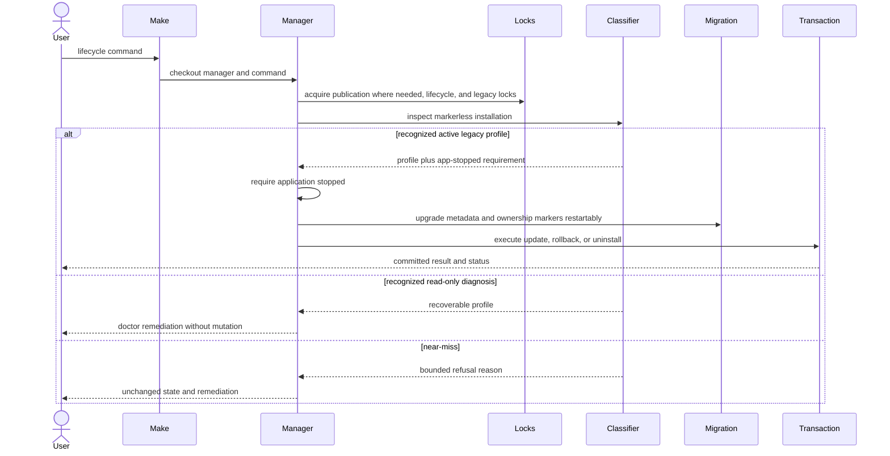

# Legacy Installation Recovery - Plan

## Goal Capsule

- **Objective:** Let every lifecycle command safely recover a proven Legacy Installation created by the initial manager, including the complete markerless layout observed on the affected host, without weakening ownership refusal for ambiguous paths.
- **Authority:** The confirmed user scope, the affected-host fingerprint, existing Managed Installation safety invariants, shipped transaction behavior, and freedesktop/POSIX contracts apply in that order.
- **Execution profile:** Characterize the shipped profiles first, add red regression scenarios for the missing profile and its near-misses, then change the shared classifier and lifecycle consumers.
- **Stop conditions:** Stop if a proposed profile cannot prove every path it may adopt or remove, if recovery requires adding ownership markers by hand, or if a change would claim a state-less modern integration that no shipped layout can distinguish from a near-miss.
- **Tail ownership:** Completion includes lifecycle behavior, diagnostics, portability evidence, documentation, patch-release readiness, and live validation on an affected upgrade plus a clean installation.
- **Companion evidence:** Execute `docs/user-workflows-test-plans/legacy-installation-recovery-user-workflow-test.md` and track every finding in `docs/workorders/legacy-installation-recovery-issues-workorder.md`.

---

## Product Contract

### Summary

Recognized initial-manager installations self-heal through normal lifecycle commands, while ambiguous or foreign layouts remain unchanged and fail with actionable diagnostics.
The change covers update, composite install, rollback, uninstall, doctor, interrupted recovery, cross-desktop compatibility, and release guidance.

### Problem Frame

The affected host has a complete markerless Legacy Installation: valid current and previous releases, legacy release metadata, the canonical application symlink, manager-marked legacy desktop entries, release-matching icon and MIME assets, legacy MIME defaults, and no `state.json`.
The checkout manager and installed manager are byte-identical, so stale manager publication is not the cause.

`migrate_legacy_layout_if_needed` accepts the release inventory, empty cache, absent state, application link, desktop markers, and release asset hashes.
It then rejects the installation only because `legacy_post_link_defaults_are_unclaimed` treats any manager desktop ID as unsafe, including the proven legacy IDs written by the initial manager.
The existing regression suite intentionally rejects state-less modern manager defaults but has no fixture for a complete initial-manager installation with owned legacy defaults.

The seven `doctor` findings are derivative: the command looks only for modern desktop paths and a published state file, so it reports invalid/different integration and bad state permissions instead of identifying one recoverable Legacy Installation.
Manual deletion is unsafe and does not solve the public compatibility defect for other users.

### Actors

- A1. An existing user whose Devin Desktop was installed or updated by the initial manager before the ownership-marker release.
- A2. A current user with a fresh, fully owned, interrupted, modified, or foreign installation candidate.
- A3. A maintainer reviewing ownership boundaries, release evidence, and user-facing recovery guidance.

### Requirements

**Classification and ownership proof**

- R1. The manager recognizes the affected complete markerless layout as a Legacy Installation only when every installation, release, link, cache, state, integration, and default-association invariant matches a shipped initial-manager outcome.
- R2. A legacy default is recoverable only when it maps each supported MIME type to the correct manager-marked legacy desktop role, that desktop entry passes the exact semantic contract below, and every manager-looking association is attributable to one of the three user MIME files already covered by transaction backup.
- R3. Empty defaults and safe non-manager desktop defaults remain recoverable and are preserved as the user's originals.
- R4. Within complete-profile adoption, state-less modern manager defaults, cross-role or untraceable legacy defaults, manager IDs in desktop-specific MIME files, missing or modified legacy desktop entries, mismatched release assets, unsafe link types, unknown root entries, malformed MIME records, and query failures remain fail-closed without mutation; characterized fresh-install compatibility is unchanged.
- R5. One shared read-only classification contract supplies both migration authorization and diagnostics so acceptance and explanation cannot drift.

**Lifecycle recovery**

- R6. `update`, `install`, `rollback`, `uninstall`, and `uninstall-yes` recover the recognized complete Legacy Installation through their existing lock and transaction boundaries.
- R7. A profile with a linked active release requires the application to be stopped before ownership metadata or integration state is mutated.
- R8. Recovery upgrades legacy release metadata and root markers restartably, then the requested lifecycle action either commits fully or preserves a state that the same command can resume.
- R9. Update and rollback publish modern manager-specific integration, write state with mode `0600`, normalize proven legacy defaults to an unknown/empty original, preserve safe external defaults, remove exact legacy IDs from both default and added-association records in transaction-owned user MIME files, and remove only proven legacy integration.
- R10. Direct uninstall removes proven manager defaults, links, legacy integration, state, cache, and releases while preserving the separate Devin CLI, user configuration, modified files, and unrelated MIME handlers.
- R11. Repeated commands and interruptions before or after marker, metadata, transaction, default, state, activation, and cleanup publication remain idempotent or recoverable.

**Diagnostics and support**

- R12. `doctor` detects a recoverable Legacy Installation before emitting modern-state derivative failures, exits `1`, names direct `update` and uninstall commands as supported recovery paths, and makes clear that lifecycle commands revalidate under lock before mutation.
- R13. Migration refusal exits `1`, names the stable failed-invariant code plus an escaped conflicting path/default at a safe level, says that nothing was claimed, and gives a same-command or inspect/move-aside remediation without exposing file contents.
- R14. `status` and `check` retain their current read-only behavior, and no read-only command creates markers, state, cache content, or desktop changes.

**Portability and release**

- R15. Offline fixtures cover fresh, public `0.1.0`, complete initial-manager, interrupted, modified, mixed-default, and foreign layouts across current supported Bash/GNU userlands.
- R16. The focused portability smoke cannot false-green when recovery scenarios are absent, while the ordinary full suite and coverage gate remain the canonical local evidence.
- R17. README, installation, support, concepts, changelog, and release guidance distinguish recoverable legacy profiles from conflicts and prohibit manual marker creation or lock deletion.
- R18. The fix prepares a `0.1.1` patch release without changing ownership, release-metadata, or state schema versions; publishing the release remains a separate maintainer action.
- R19. Live acceptance separates automated evidence from mutation on the affected host and clean-install evidence on a disposable second environment.

### Key Flows

- F1. Recover and update
  - **Trigger:** A1 invokes `make update` or `make install` on the complete markerless Legacy Installation.
  - **Steps:** Preflight and locks complete, the shared classifier proves the legacy profile, the app-stopped gate passes, restartable ownership migration runs, and the ordinary update transaction publishes the latest release and modern integration.
  - **Outcome:** The command succeeds or leaves a validated same-command retry state; `status` and `doctor` describe one healthy Managed Installation.
  - **Covered by:** R1-R9, R11-R19.
- F2. Recover and remove
  - **Trigger:** A1 invokes interactive or prompt-free uninstall on the same profile.
  - **Steps:** Consent precedes mutation, the classifier and app-stopped gate pass, ownership migration proves deletion authority, and the existing uninstall transaction clears manager-owned associations and files.
  - **Outcome:** The managed desktop application is removed without leaving dangling legacy defaults or deleting the separate CLI and user configuration.
  - **Covered by:** R1-R8, R10-R13, R17-R19.
- F3. Diagnose before recovery
  - **Trigger:** A1 runs `make doctor` before a mutating lifecycle command.
  - **Steps:** Doctor validates the active release and runs the read-only legacy classifier before modern integration checks.
  - **Outcome:** It reports one recoverable legacy-state diagnosis and supported next actions without mutating the installation.
  - **Covered by:** R5, R12-R14, R17.
- F4. Refuse a near-miss
  - **Trigger:** A2 presents a markerless root whose defaults or files resemble the manager but fail one proof invariant.
  - **Steps:** Classification records the first deterministic reason, migration stops before markers or metadata are written, and the command prints bounded remediation.
  - **Outcome:** User data remains byte-identical and no path becomes manager-owned.
  - **Covered by:** R1-R5, R13-R16.
- F5. Resume after interruption
  - **Trigger:** A2 reruns the same lifecycle command after a controlled process failure at a migration or transaction publication boundary.
  - **Steps:** Locks, temporary validation, ownership markers, metadata, and journals resolve by their existing precedence rules before new work starts.
  - **Outcome:** Recovery finishes once, rejects malformed candidates, and never relies on deleting persistent lock files.
  - **Covered by:** R6-R11, R13, R15-R16.

### Acceptance Examples

- AE1. Given the affected-host fingerprint with current and previous valid releases, absent state, owned legacy integration, and all three expected legacy defaults, when update runs, then the latest release activates, ownership metadata and mode-`0600` state exist, modern integration replaces legacy integration, and doctor is healthy.
- AE2. Given the same layout where one MIME default is empty and another is a safe external desktop ID, when update runs, then the owned legacy default normalizes to empty while the external and empty defaults are recorded without being overwritten unless normal registration rules allow it.
- AE3. Given a legacy desktop marker with an unexpected command, role, icon, MIME declaration, symlink type, or default mapping, when any lifecycle mutation runs, then it returns nonzero before ownership mutation and preserves the complete tree and user defaults.
- AE4. Given state-less modern manager desktop defaults, when migration runs without a valid transaction journal or state file, then the existing refusal remains because the lost original defaults cannot be attributed to the initial-manager profile.
- AE5. Given interruption after one restartable migration publication or during the ordinary update transaction, when the same command is rerun, then it completes or emits the existing recovery-preserved diagnostic without duplicating releases or defaults.
- AE6. Given a recognized complete Legacy Installation, when prompt-free uninstall runs, then it removes manager-owned legacy defaults and files, preserves unrelated configuration and the Devin CLI, and leaves no manager-owned staged cleanup except a valid resumable record.
- AE7. Given a recognized complete Legacy Installation, when doctor runs before recovery, then it returns one root-cause diagnosis rather than seven modern-state symptoms and performs no filesystem mutation.
- AE8. Given an effective legacy default with no matching record in a transaction-owned user MIME file, a wrong-role/modern manager ID in any inspected user MIME file, or a manager ID in a desktop-specific MIME file, when classification runs, then it rejects before mutation because the association source cannot be safely attributed and reversed.
- AE9. Given doctor reports a recoverable profile and one invariant changes afterward, when a lifecycle mutation starts, then it independently reclassifies under all lifecycle locks and refuses before ownership mutation; the earlier doctor result grants no authority.

### Success Criteria

- The exact affected-host profile becomes a deterministic offline regression fixture and succeeds through update, install, rollback, and both uninstall modes.
- Every near-miss scenario remains byte-for-byte unchanged and no current fail-closed ownership regression is weakened.
- Doctor and lifecycle failures distinguish recoverable legacy state from unsafe conflicts with one actionable outcome.
- Focused, full, coverage, portability, package, and release-readiness gates agree on the new contract.
- The affected host installs manager `0.1.1`, updates Devin Desktop from `3.5.17` to the observed available stable release or newer, then passes doctor and application smoke acceptance.

### Scope Boundaries

**In scope**

- The markerless installation classifier, legacy default proof, app-running boundary, lifecycle migration, doctor diagnostics, regression fixtures, portability smoke, documentation, and patch-release readiness.
- Existing modern state, transaction, cleanup, lock, release, desktop, and MIME contracts where they interact with recovery.

**Out of scope**

- Manual sentinel injection, recursive deletion, permission bypasses, or a one-host cleanup recipe.
- A general-purpose repair command that adopts ambiguous files, a new ownership schema, or a rewrite of the Bash/Make architecture.
- Automatic restoration of pre-initial-manager MIME defaults that were never recorded; the manager must not invent historical user configuration.
- Changing the Devin Desktop manifest, package format, upstream application, architecture scope, or user-namespace policy.
- Publishing, tagging, or merging a release without separate maintainer authorization.

---

## Planning Contract

### Key Technical Decisions

- KTD1. **Self-heal only an exact recognized profile.** Recognized manager-owned legacy states migrate through normal lifecycle commands, while ambiguous states remain fail-closed. (session-settled: user-approved — chosen over manual recovery-only handling: universal supported recovery is required without weakening ownership safety.)
- KTD2. **Model the complete initial-manager layout separately from the public post-link interruption.** The new profile permits correctly mapped owned legacy defaults but retains the existing rejection of state-less modern manager defaults.
- KTD3. **Strengthen profile-specific desktop proof beyond the marker.** The initial-manager profile validates desktop syntax and semantic role, canonical command paths, legacy icon identity, and expected MIME declarations before a legacy ID can authorize default migration or deletion.
- KTD4. **Treat proven legacy defaults as self-owned but historically lossy.** Their unknown predecessors normalize to empty; empty or safe external defaults remain preservable originals; the manager never guesses a prior handler.
- KTD5. **Centralize classification and reason reporting.** A read-only classifier returns a recognized profile or a bounded failure reason that migration and doctor consume; removal reuses the same ownership predicates as acceptance.
- KTD6. **Keep recovery inside existing locks and journals.** Profile classification may read before mutation, but an active linked release must pass the app-stopped check before marker or metadata publication; later integration/default/state changes remain inside the ordinary transaction.
- KTD7. **Do not add a public repair command.** Update, install, rollback, and uninstall already own the supported mutations; doctor supplies the read-only recovery explanation.
- KTD8. **Ship as a patch without schema churn.** `0.1.1` communicates the public compatibility fix, while unchanged persisted formats keep their independent schema version `1` values.
- KTD9. **Prove and clean legacy defaults only in transaction-owned user files.** The three already-backed-up MIME files are the only accepted provenance for manager-created legacy records; desktop-specific or system records never grant adoption authority.
- KTD10. **Keep doctor advisory and lifecycle authorization authoritative.** Doctor classifies without creating a persistent lock or token; every mutation reclassifies from scratch after all existing locks are held, so a prior diagnosis can never authorize later adoption.

### Scope and Evidence Capsule

| Dimension | Decision |
|---|---|
| Selected surfaces | CLI terminal contract; data/persistence migration; infrastructure/operations; Linux desktop lifecycle; documentation/release process; mixed-system handoff between Make, manager, XDG files, and hosted CI. |
| Supported environments | Existing glibc Linux x86_64, Bash 4.4+, GNU Make 4.3 behavior, XDG user-local install, local same-device filesystem, and current dependency/capability policy. |
| Local evidence | Offline focused Bats, aggregate suite, ShellCheck, Bashcov, repository policy, deterministic packaging, and static portability-runner assertions. |
| Hosted evidence | Existing canonical Ubuntu, Debian-family, Fedora, and minimum-toolchain jobs on one current head; no new full-suite owner. |
| Manual evidence | A preserved snapshot of the affected host plus a disposable clean supported desktop environment. |
| External evidence | The live stable manifest is used only during separately authorized affected-host/clean-environment acceptance; ordinary tests remain offline. |
| Artifact root | First-party repository paths under `docs/plans`, `docs/user-workflows-test-plans`, and `docs/workorders`; no private sidecar is required. |

No browser or graphical UI is introduced. Terminal readability, status/stream semantics, app lifecycle, URL/workspace launch behavior, desktop caches, and native desktop acceptance are the applicable interaction dimensions.

### Complete Initial-Manager Recognition Contract

The new branch is deliberately narrower than the existing fresh/pre-activation compatibility paths. It applies only when the install root has a valid active legacy release inventory, no durable `state.json`, and the complete integration/default shape below. Existing marker-only pre-`0.1` integration replacement during a genuinely fresh install keeps its characterized behavior and never becomes proof for adopting a non-empty install root.

#### Classifier interface

Keep the classifier inside `bin/devin-desktop-manager`; do not create a general framework or public command. A single read-only `classify_markerless_layout`-style function populates fixed globals rather than using `eval` or caller-parsed prose:

- `LEGACY_CLASSIFICATION`: `fresh`, `public-pre-activation`, `public-post-link`, `initial-complete`, `public-stateful`, or `refused`.
- `LEGACY_REASON`: one stable ASCII code from `install-root`, `release-inventory`, `cache-root`, `state-root`, `app-link`, `main-desktop`, `url-desktop`, `icon`, `mime`, `default-query:<mime-key>`, `default-shape:<mime-key>`, `default-provenance:<mime-key>`, or `desktop-specific-default:<mime-key>`.
- `LEGACY_OBSERVED`: at most one path or desktop ID needed to explain the result; render it through the existing bounded `preflight_escape` contract and never include file content.
- `LEGACY_REQUIRES_APP_STOP`: `true` only for recognized profiles with an active release link.
- Three normalized original-default globals: empty for a proven legacy manager default, otherwise the safe empty/external effective ID returned by `query_default`.

Return `0` only for a recognized profile and `1` for a refused candidate. Callers branch on the globals; no caller reimplements a subset of the predicates. Classification performs no `mkdir`, `touch`, `chmod`, lock creation, cache refresh, MIME write, marker publication, or temporary cleanup.

#### Desktop semantic proof

Both legacy desktop paths must be user-owned, mode-regular non-symlinks, pass `desktop-file-validate`, and contain exactly one `[Desktop Entry]` section plus only the expected `new-empty-window` action section on the main entry. A small data parser treats values as data, rejects duplicate security-relevant keys or sections, and does not source or execute desktop content.

| Role | Required semantic values |
|---|---|
| Both | `Type=Application`; one exact `X-Devin-Desktop-Manager=true`; the decoded `TryExec` value equals `${APP_COMMAND}` exactly without symlink resolution; `Icon=devin-desktop`; `StartupWMClass=Devin`; `Keywords=vscode`; no additional `Exec`, `TryExec`, manager marker, or action section beyond those named below. |
| Main | Top-level `Exec` is the existing desktop-escaped `${APP_COMMAND}` followed by exactly `%F`; `MimeType` is exactly the set `{application/x-devin-desktop-workspace}`; `StartupNotify=false`; `Categories` is exactly the set `{TextEditor, Development, IDE}`; `Actions` is exactly `new-empty-window`; that action contains only display name/localizations, the same command followed by `--new-window %F`, and `Icon=devin-desktop`. |
| URL | Top-level `Exec` is the same command followed by exactly `--open-url %U`; `MimeType` is exactly the set `{x-scheme-handler/devin, x-scheme-handler/windsurf}`; `NoDisplay=true`; `StartupNotify=true`; `Categories` is exactly the set `{Utility, TextEditor, Development, IDE}`; no desktop action section. |

Ordering and localized `Name`, `GenericName`, and `Comment` presentation keys may differ. The accepted top-level key set is otherwise exactly the keys named in the table plus those three display fields; unknown behavior-bearing keys such as `DBusActivatable`, extra actions, or additional field codes reject. Any extra executable field, conflicting duplicate, wrong MIME role, path mismatch, or unsafe parse also rejects the complete profile. The legacy icon and MIME XML remain byte-identity-proven by SHA-256 against current or previous validated release assets.

#### Default provenance and normalization

The transaction-owned user files are exactly `${CONFIG_HOME}/mimeapps.list`, `${DATA_HOME}/applications/mimeapps.list`, and `${DATA_HOME}/mimeapps.list`. Each present candidate must be a non-symbolic regular file before it can participate. Parse `[Default Applications]`, `[Added Associations]`, and `[Removed Associations]` without executing content; IDs must satisfy `is_safe_desktop_id`.

| MIME key | Expected legacy role | Effective/default cases accepted | Persisted original |
|---|---|---|---|
| `x-scheme-handler/devin` | `devin-desktop-url-handler.desktop` | Expected legacy ID with at least one matching transaction-owned record; or empty/safe external ID with no wrong-role/modern manager record. | Empty for expected legacy; otherwise effective empty/external ID. |
| `x-scheme-handler/windsurf` | `devin-desktop-url-handler.desktop` | Same rule as Devin URL. | Same normalization rule. |
| `application/x-devin-desktop-workspace` | `devin-desktop.desktop` | Expected legacy ID with at least one matching transaction-owned record; or empty/safe external ID with no wrong-role/modern manager record. | Empty for expected legacy; otherwise effective empty/external ID. |

Correct-role legacy IDs may coexist underneath an effective safe external default because that is a plausible initial-manager write followed by a user choice. During the ordinary transaction, remove those exact legacy IDs from both Default and Added Associations while preserving every unrelated ordered entry, comments, sections, file mode, and the effective external choice. A modern manager ID, wrong-role legacy ID, manager ID under an unrelated MIME key/Removed Associations, or any manager ID in a user `*-mimeapps.list` desktop-specific file makes provenance ambiguous and rejects adoption. System configuration is read only through the effective `xdg-mime` result and never grants or receives ownership.

The manager re-queries all three effective defaults after the planned rewrite and before transaction commit. The result must be the newly registered manager ID where the prior value was empty/proven legacy, or the preserved external ID where registration intentionally yielded to the user. Any mismatch triggers existing transaction restore.

### Lifecycle and Diagnostic Contract

#### Mutation order

1. Public preflight and environment validation complete without migration mutation.
2. Mutating entry points acquire the existing publication lock where applicable, lifecycle lock, and shipped legacy `.manager.lock` in their established order; interrupted transaction/cleanup recovery keeps its current precedence.
3. The classifier runs under those locks. A refused result exits `1` before app-stop checks, marker/metadata publication, transaction backup, or desktop/default mutation.
4. An active recognized profile runs `require_app_stopped`. A running app exits `1` with no migration mutation.
5. Restartable legacy cleanup, release-metadata upgrades, root creation/mode normalization, and cache/state/install ownership markers run in the existing migration order. A process death leaves only already-recognized numeric temporaries or a partially published marker/metadata state accepted by the same classifier on retry.
6. The requested update/rollback/uninstall operation begins its existing transaction. Integration/default/state changes and rollback-on-failure stay owned by that transaction; uninstall consent remains before all mutation.
7. The command commits or retains the existing validated journal/cleanup record and tells the user to rerun the same command. It never asks the user to delete a lock, journal, marker, or release tree.

#### Terminal outcomes

| Condition | Direct status and stream | Required message content |
|---|---|---|
| Doctor finds `initial-complete` | Exit `1`; diagnosis on stderr; no derivative modern-file list. | `recoverable Legacy Installation`; direct `devin-desktop-manager update` and `devin-desktop-manager uninstall` choices; lifecycle revalidation under lock. |
| Lifecycle finds `initial-complete` | Continue silently except for the existing migration information line, then requested-command output. | Name the verified legacy profile and ownership schema without printing user file content. |
| Classifier refuses | Exit `1`; one bounded error on stderr. | Stable reason code, escaped observed path/ID, `ownership was not claimed`, inspect/move-aside guidance, and same-command retry. |
| App is running | Existing direct status `1` and app-stopped remediation. | No claim that migration began; same command may be retried after exit. |
| Make wrapper | GNU Make zero/nonzero only. | Preserve manager stderr; composite install retains its manager-installed/application-failed distinction. |

Doctor's unlocked result is advisory only. It is not persisted or passed to another command; lifecycle callers always classify the current on-disk state again under their normal lock set. A concurrent doctor may conservatively report recovery or conflict from the state it observed, but it cannot broaden deletion authority.

### Recognized Profile Matrix

| Profile | State/default shape | Result | Mutation owner |
|---|---|---|---|
| Fresh markerless root | Empty except the validated public lock | Adopt as a fresh root | Existing layout initialization |
| Public pre-activation | Valid legacy releases without active links, state, or integration | Resume download/activation | Existing legacy migration |
| Public post-link interruption | Active valid release, no state, recoverable integration, no manager defaults | Resume state publication | Existing legacy migration |
| Complete initial-manager installation | Active valid release, no state, semantically owned legacy integration, correctly mapped and traceable legacy/external/empty defaults | Require app stopped, migrate, then run requested lifecycle action | New profile branch plus existing transaction |
| Public stateful `0.1.0` | Valid legacy state and managed-file hashes | Upgrade metadata and root ownership | Existing legacy migration |
| Owned installation | Valid ownership markers and owned release inventory | Run normal lifecycle action | Existing transaction |
| Near-miss or foreign root | Any failed type, identity, content, mapping, or query invariant | Refuse without mutation | User inspection/move-aside only |

### High-Level Technical Design

The classifier is a pure authorization boundary; mutation begins only after it yields a recognized profile and all required locks and active-app gates are satisfied.

```mermaid
stateDiagram-v2
  [*] --> Inspect
  Inspect --> Owned: valid root marker
  Inspect --> Fresh: empty public-lock root
  Inspect --> PublicLegacy: known pre-activation, post-link, or stateful shape
  Inspect --> InitialComplete: owned legacy integration and recoverable defaults
  Inspect --> Refused: any invariant mismatch
  Fresh --> Owned: publish ownership marker
  PublicLegacy --> Owned: restartable metadata and marker migration
  InitialComplete --> AppGate
  AppGate --> Owned: application stopped; migrate
  AppGate --> Refused: application running; no migration mutation
  Owned --> RequestedAction
  Refused --> [*]
  RequestedAction --> [*]
```

All mutating entry points converge on the same migration gate before their existing lifecycle-specific transaction.

### Sequencing

1. Freeze the shipped migration and refusal outcomes with characterization scenarios, then add the exact affected-host profile and adversarial near-misses as red tests.
2. Introduce the shared profile classifier and semantic legacy desktop/default proof without changing mutation behavior.
3. Route migration and every lifecycle command through the new recognized profile while preserving lock, app-running, transaction, and cleanup order.
4. Route doctor and failure diagnostics through the same classification result.
5. Extend portability, documentation, versioning, release checks, and live acceptance after focused behavior is green.

### System-Wide Impact

- **Existing installations:** One previously deadlocked markerless profile becomes recoverable; owned and foreign layouts retain their current boundaries.
- **Desktop integration:** Legacy IDs are treated as migration inputs only when their files prove the correct role; normal post-migration IDs remain manager-specific.
- **User configuration:** Known manager defaults can be removed or normalized, external defaults stay user-owned, and unknown historical defaults are never reconstructed.
- **Lifecycle safety:** Active legacy releases gain an earlier app-stopped gate before metadata adoption; existing transaction and rollback behavior remains authoritative afterward.
- **Diagnostics:** Doctor reports the state-machine root cause before checking modern managed files; lifecycle errors expose a bounded invariant rather than a generic ownership message.
- **Release lifecycle:** The implementation, docs, repository policy, portability smoke, and `0.1.1` package must ship together so public `0.1.0` users can receive the repair.

### Risks and Mitigations

| Risk | Mitigation |
|---|---|
| A copied desktop marker tricks migration into deleting user files. | Require profile-specific semantic desktop validation, exact MIME-to-role mapping, canonical command paths, and release-matching assets before adoption. |
| Recovery erases a user-selected default. | Accept safe external or empty defaults as originals and only normalize a proven manager-owned legacy default. |
| A running legacy app observes a partially adopted release. | Require the app-stopped check before any complete-profile marker or metadata mutation. |
| Diagnostics and authorization diverge. | Centralize the complete classifier and stable reason vocabulary; tests compare doctor and mutation classification for the same fixtures. |
| A process dies after partial legacy publication. | Reuse numeric temporary validation and restartable marker/metadata migration, then existing transaction journals for integration/default/state changes. |
| The fix passes on the affected desktop but breaks another Linux userland. | Keep fixtures offline, add them to the false-green-resistant portability selection, and separate container userland evidence from native desktop acceptance. |
| Version bump changes persisted compatibility accidentally. | Keep all schema constants independent and unchanged; repository/release tests assert manager/Make/changelog consistency. |

### Alternative Approaches Considered

- **Tell affected users to move or delete the installation:** Rejected because the layout is provably manager-created and the same deadlock can affect every early adopter.
- **Allow any manager desktop ID when state is absent:** Rejected because state-less modern defaults are not attributable to the initial-manager profile and would weaken the existing safety boundary.
- **Trust the marker line alone:** Rejected because it does not prove command, role, icon, or MIME semantics strongly enough for a newly adopted complete profile.
- **Add `make repair --force`:** Rejected because force-based adoption turns ambiguity into deletion authority and duplicates lifecycle transaction ownership.
- **Restore a guessed browser/editor/workspace handler:** Rejected because the initial manager did not persist those originals; empty is honest and lets freedesktop lookup continue through remaining configuration levels.
- **Bump ownership or state schemas:** Rejected because the persisted structures do not change; only recognition of an older pre-schema layout changes.

### Sources and Research

- The affected-host fingerprint observed on 2026-08-09: markerless install root, valid `3.5.17` current and `3.4.27` previous releases, absent state, canonical app symlink, manager-marked legacy desktop files, release-matching assets, and three legacy default IDs.
- `bin/devin-desktop-manager` owns `migrate_legacy_layout_if_needed`, legacy validators, default normalization, transaction recovery, doctor, and uninstall.
- `tests/manager.bats` contains the public `0.1.0` migration, post-link refusal, pre-`0.1` fresh-install integration, interruption, near-miss, and cleanup regressions but not the affected complete profile.
- `docs/solutions/best-practices/behavior-preserving-simplification-for-security-sensitive-bash.md` requires complete-predicate centralization, characterization-first changes, independent schema contracts, and auditability at ownership boundaries.
- `docs/plans/2026-07-27-001-fix-portable-make-commands-plan.md` and the shipped PR #4 establish checkout-manager execution, lock bridging, target-specific preflight, portability lanes, and evidence ownership.
- [Freedesktop MIME Applications Specification](https://specifications.freedesktop.org/mime-apps/1.0/default.html) defines defaults as desktop file IDs and fallback when an entry is not installed.
- [Freedesktop Desktop Entry Specification](https://specifications.freedesktop.org/desktop-entry/latest-single/) defines desktop file IDs, `Exec`/`TryExec`/`MimeType`, and vendor-prefixed `X-PRODUCT` ownership fields.
- [XDG Base Directory Specification](https://specifications.freedesktop.org/basedir/) keeps persistent manager state under `XDG_STATE_HOME` and user data under `XDG_DATA_HOME`.
- [POSIX `rename`](https://pubs.opengroup.org/onlinepubs/9799919799/functions/rename.html) supports the existing same-filesystem atomic replacement pattern but does not by itself claim power-loss durability.

### File and Contract Ownership

| Surface | Owning unit | Boundary |
|---|---|---|
| `bin/devin-desktop-manager`: recognition predicates, semantic desktop/MIME parsing, normalized classifier result | U1 | U1 may reorganize existing legacy predicates only as needed for one complete classifier; no public command or separate module. |
| `bin/devin-desktop-manager`: lock/app-stop/migration sequencing, association cleanup, lifecycle consumption, transaction recovery | U2 | U2 consumes U1 results and does not duplicate classification logic. |
| `bin/devin-desktop-manager`: doctor and reason rendering | U3 | U3 renders U1 result codes and owns no adoption predicate. |
| `tests/manager.bats` | U1-U3 by `[LIR-U*-*]` prefix | Shared fixture helpers land in U1; each later unit owns only its prefixed scenarios. |
| `Makefile`, `tests/makefile.bats`, `tests/desktop.bats` | U2 for lifecycle behavior; U3 for diagnostics; U4 for version/repository consistency | Existing target grammar and lock transport remain unchanged. |
| Public documentation, changelog, release guidance, companion artifacts | U4 | U4 is the sole prose/release owner; U1-U3 provide behavior facts and scenario evidence. |
| `tests/run-portability-smoke`, `tests/repository.bats` | U4 | Extend the existing focused selection/policy only; do not create a second runner or full-suite owner. |
| `.github/workflows/ci.yml` | Existing CI contract, inspection only | No planned change: all four jobs already invoke `tests/run-portability-smoke`; edit only if a red repository-policy test proves the existing call cannot carry the new selection. |

---

## Implementation Units

### U1. Characterize and classify the complete Legacy Installation

- **Goal:** Add one auditable read-only profile classifier that recognizes the affected initial-manager layout and rejects every unsafe near-miss.
- **Requirements:** R1-R5, R13-R15; F3-F4; AE2-AE4, AE7-AE8; KTD1-KTD5, KTD9.
- **Dependencies:** None.
- **Ownership boundary:** `bin/devin-desktop-manager` recognition/parser helpers and shared `tests/manager.bats` complete-profile fixture builders. No mutation caller changes in this unit.
- **Approach:** Preserve all existing public `0.1.0` fixtures, add a deterministic fixture matching the affected layout, implement the fixed classifier globals/reason codes, validate the exact legacy desktop and default-provenance contracts, and return one normalized result for migration and doctor consumers. Parse data with bounded Bash/awk helpers; never source desktop or MIME files and never introduce a generic classifier framework.
- **Red-first test:** Add `[LIR-U1-R01]` with the live-shaped active layout and prove it fails only at the current `legacy_post_link_defaults_are_unclaimed` boundary before changing predicates. Add each near-miss independently and first observe the old generic acceptance/refusal or missing reason that the scenario is meant to replace.
- **Minimal implementation:** One classifier plus role-specific semantic/default helpers; existing predicates remain the leaf validators where their contracts already match.
- **Patterns to follow:** Reuse `legacy_release_metadata_is_valid`, `legacy_post_link_integration_is_recoverable`, `asset_matches_release`, safe desktop-ID checks, and complete-predicate centralization from the repository learning.
- **Test scenarios:**
  1. `[LIR-U1-C01]` Existing fresh, public pre-activation, post-link-unclaimed, stateful `0.1.0`, owned, and near-miss fixtures retain their current classifications.
  2. `[LIR-U1-R01]` The exact complete layout with current/previous releases, absent state, owned legacy integration, matching assets, and expected legacy defaults classifies as recoverable.
  3. `[LIR-U1-R02]` Current-only inventory, evicted cache, absent versus empty safe state root, and mixed empty/external/owned defaults classify consistently without creating paths.
  4. `[LIR-U1-R03]` Wrong legacy role, state-less modern manager ID, unsafe desktop ID, query failure, or missing/unowned default target rejects with a stable reason.
  5. `[LIR-U1-R04]` Desktop syntax, command, TryExec, icon, MIME role, marker, type, symlink, and duplicate/conflicting-key near-misses reject without changing the fixture.
  6. `[LIR-U1-R05]` Existing release, root, temporary, hard-link, symlink, asset-hash, and unknown-entry refusal snapshots remain byte-identical.
  7. `[LIR-U1-R06]` Default/Added/Removed Association records, correct-role legacy IDs under an external effective default, absent provenance, desktop-specific files, wrong MIME keys, modern IDs, malformed records, and non-regular user MIME files follow the exact provenance matrix.
- **Focused verification:** `bats --filter '^\[LIR-U1-[CR][0-9][0-9]\]' tests/manager.bats`.
- **Aggregate/hosted/manual gates:** `make verify` after U1-U3; no hosted or manual gate is credited by U1 alone.
- **Failure/recovery behavior:** A parsing/query error yields `refused` plus one reason and a byte-identical fixture. Classification never cleans partials or creates state, so retry is safe after the user corrects or moves aside the named conflict.
- **Review lenses:** Plan architecture, correctness, ownership security, data-integrity/migration, Bash maintainability, and test strategy.

### U2. Recover every mutating lifecycle flow transactionally

- **Goal:** Make normal lifecycle commands adopt the recognized complete profile and finish or resume their requested action safely.
- **Requirements:** R6-R11, R14-R16; F1-F2, F5; AE1-AE6; KTD1, KTD4, KTD6-KTD7.
- **Dependencies:** U1.
- **Ownership boundary:** Lifecycle/migration/default-cleanup functions in `bin/devin-desktop-manager`, existing Make lifecycle wrappers, and `[LIR-U2-*]` tests. U2 treats the U1 classifier as read-only authority and does not change its predicates.
- **Approach:** Consume the U1 profile only after existing publication/lifecycle/legacy locks are held, require the app stopped before active-profile mutation, reuse restartable ownership migration, and leave activation, defaults, state, rollback, and uninstall inside their current transaction owners. Extend the narrow MIME rewrite to remove exact proven legacy IDs from Default and Added Associations in the three already-snapshotted files, record every durable result, re-query expected defaults, and restore through the existing journal on mismatch.
- **Red-first test:** Add one separate lifecycle test per public entry point and one exact failure hook per publication boundary; observe the present ownership refusal or controlled failure before implementing. Use readiness barriers and exact-call counters rather than sleeps.
- **Minimal implementation:** Add one new recognized migration branch and the smallest section-aware legacy-ID removal needed by the decided provenance contract; do not alter lock descriptors, journal format, state schema, or release schema.
- **Patterns to follow:** Mirror existing migration temporary recovery, mixed-version lock bridging, `backup_transaction`, `restore_transaction`, uninstall cleanup records, and byte-identical failure snapshots.
- **Test scenarios:**
  1. `[LIR-U2-R01]` Update from the complete profile activates a newer fixture release, adds markers/metadata, writes mode-`0600` state, replaces legacy integration, and retains one rollback release.
  2. `[LIR-U2-R02]` Composite install publishes the reviewed manager and completes the same recovery; an application-stage failure preserves the documented rerun contract.
  3. `[LIR-U2-R03]` Rollback from the complete profile swaps current/previous once, publishes modern integration/state, and a second rollback returns to the original release.
  4. `[LIR-U2-R04]` Interactive yes and `uninstall-yes` remove proven legacy defaults/assets/releases while negative, blank, EOF, SIGINT, and non-TTY outcomes retain existing consent behavior.
  5. `[LIR-U2-R05]` A running app blocks complete-profile migration before marker, metadata, default, state, or integration mutation.
  6. `[LIR-U2-R06]` Failures after marker temporary, metadata temporary, marker publication, transaction backup, association update, state write, activation, and staged uninstall recover on the same-command retry.
  7. `[LIR-U2-R07]` Repeated update/install/uninstall behavior remains idempotent and no command duplicates releases, defaults, state, or cleanup records.
  8. `[LIR-U2-R08]` Correct-role legacy IDs are removed from Default and Added Associations without reordering unrelated IDs; expected modern/external effective defaults re-query correctly, while a post-write mismatch restores all three MIME files and integration/state.
- **Focused verification:** `bats --filter '^\[LIR-U2-R[0-9][0-9]\]' tests/manager.bats tests/makefile.bats tests/desktop.bats`.
- **Aggregate/hosted/manual gates:** Run the existing manager/Make/desktop aggregate after focused green; live mutation remains pending until U4 readiness.
- **Failure/recovery behavior:** Failure before transaction backup leaves only restartable ownership metadata/markers; failure after backup restores or preserves the validated journal. A running app or refused classifier leaves every adoption target unchanged.
- **Review lenses:** Correctness, reliability, data integrity, ownership security, lifecycle concurrency/ordering, CLI interaction, and test strategy.

### U3. Replace derivative doctor output with root-cause diagnostics

- **Goal:** Give users one reliable explanation and supported next action for recoverable versus unsafe markerless installations.
- **Requirements:** R5, R12-R14; F3-F4; AE3-AE4, AE7-AE9; KTD5, KTD7, KTD10.
- **Dependencies:** U1, U2.
- **Ownership boundary:** Classifier-result rendering and doctor snapshot-coherence logic in `bin/devin-desktop-manager`, Make wrapper propagation, and `[LIR-U3-*]` tests. Documentation wording remains U4-owned.
- **Approach:** Run the shared read-only classifier before modern doctor integration checks, render one recoverable diagnosis for a known profile, and propagate bounded reason-specific refusal text through lifecycle and composite install without adding a repair command. Lifecycle callers always discard any earlier doctor result and reclassify under lock.
- **Red-first test:** Lock exact status, stream, stable reason token, no-mutation, and remediation substrings before changing diagnostics; avoid golden snapshots of incidental prose.
- **Minimal implementation:** One renderer over U1 globals and one early doctor classification branch; no fingerprint system, persisted authorization token, machine-readable output mode, or diagnostic framework.
- **Patterns to follow:** Use existing `error:`, `Installation problems:`, status `0/1/2`, same-command retry, escaped-path, and no-lock-deletion conventions.
- **Test scenarios:**
  1. `[LIR-U3-R01]` Doctor on the complete profile returns one recoverable legacy diagnosis, names update and uninstall choices, and does not print seven modern-state derivative findings.
  2. `[LIR-U3-R02]` Doctor remains healthy on a valid owned installation and retains current warnings for user-selected non-manager defaults and optional KDE tooling.
  3. `[LIR-U3-R03]` Each near-miss category yields one bounded invariant/path/default reason, states that ownership was not claimed, and preserves stdout/stderr/status conventions.
  4. `[LIR-U3-R04]` `status` and `check` stay read-only and unchanged; doctor creates no lock, state, marker, cache, integration, or MIME-default mutation.
  5. `[LIR-U3-R05]` `make install` distinguishes successful manager publication plus recoverable application failure from an unsafe installation conflict and gives the correct retry or inspect/move-aside action.
  6. `[LIR-U3-R06]` After doctor reports a recoverable fixture, changing any one ownership invariant makes the later mutating command reclassify under locks and refuse; no doctor result is persisted or consumed.
- **Focused verification:** `bats --filter '^\[LIR-U3-R[0-9][0-9]\]' tests/manager.bats tests/makefile.bats`.
- **Aggregate/hosted/manual gates:** `bats tests/manager.bats tests/makefile.bats tests/desktop.bats`, then `make verify`; no doctor result substitutes for live U4 acceptance.
- **Failure/recovery behavior:** Query or parse failure exits `1` without modern derivative noise or filesystem mutation. Output remains one-line escaped/bounded per observed value and never includes file contents; later mutation always revalidates current state.
- **Review lenses:** CLI interaction, accessibility/plain-text diagnostics, correctness, reliability/race behavior, security/privacy, and test strategy.

### U4. Carry recovery through portability, documentation, and patch release

- **Goal:** Prevent the fix from becoming a one-machine source-only workaround and prepare a verifiable `0.1.1` release.
- **Requirements:** R15-R19; F1-F5; AE1-AE9; KTD8-KTD10.
- **Dependencies:** U1-U3.
- **Ownership boundary:** Manager/Make version literals, changelog and all public docs, `tests/run-portability-smoke`, `tests/repository.bats`, and execution evidence in the companion artifacts. Existing CI workflow calls are inspected, not planned edits.
- **Approach:** Add recovery scenarios to the existing non-root offline compatibility selection, keep native desktop validation distinct from container evidence, align the public support contract, bump manager/Make/changelog versions to `0.1.1`, and preserve manual tag/publish authorization. The release instructions must tell affected `0.1.0` users to obtain verified `0.1.1` source/manager code before invoking recovery; the broken installed manager cannot bootstrap itself by running its old `update` command.
- **Red-first test:** Add repository-policy assertions for scenario selection, companion links, version/docs/schema contracts, and the no-force/no-manual-marker guidance; first prove the current repository fails those focused assertions.
- **Minimal implementation:** Extend the one existing smoke filter and current documentation/release machinery; do not add a CI job, workflow, compatibility harness, schema, repair command, or automatic publish step.
- **Patterns to follow:** Reuse the PR #4 portability lanes, exact version-consistency checks, one-suite coverage ownership, deterministic packaging, and companion-artifact conventions.
- **Test scenarios:**
  1. `[LIR-U4-R01]` The portability runner selects at least one complete-profile success, one near-miss refusal, one doctor, and one interruption recovery scenario and fails when the selection is empty.
  2. `[LIR-U4-R02]` Canonical Ubuntu, Debian-family, Fedora, and minimum-toolchain lanes run the focused recovery set as non-root and offline without weakening their existing network sentinel.
  3. `[LIR-U4-R03]` Repository policy asserts version alignment, changelog/support/docs coverage, companion links, unchanged schema constants, and no manual-marker or force-repair guidance.
  4. `[LIR-U4-R04]` Package and release-check produce deterministic `0.1.1` manager artifacts after the complete offline and coverage gates pass once.
  5. `[LIR-U4-R05]` Manual affected-host `make install-manager`, direct `0.1.1` version proof, update, doctor, status, application version, launcher/URL/workspace behavior, rollback, restoration of the updated release as current, and clean second-environment install record separate evidence without marking hosted/manual gates green prematurely.
  6. `[LIR-U4-R06]` Install/recovery docs start from verified `0.1.1` source or `make install-manager`, distinguish recoverable/conflicting layouts, and never instruct users to add markers, delete locks, or trust the old `0.1.0` manager to self-repair.
- **Focused verification:** `bats --filter '^\[LIR-U4-R[0-9][0-9]\]' tests/repository.bats tests/manager.bats` followed by a static `tests/run-portability-smoke --assert-offline` selection check inside its required isolated non-root environment.
- **Aggregate/hosted/manual gates:** `make verify`; `bundle exec make coverage`; `bundle exec make release-check`; existing four hosted compatibility jobs at one SHA; affected-host and disposable-environment workflows recorded separately.
- **Failure/recovery behavior:** A zero-selection portability run fails; package/release-check preserves current deterministic-output rules; hosted/manual absence stays pending; no tag, release, push, or publish occurs in implementation without separate authority.
- **Review lenses:** Product/scope, portability, desktop lifecycle, documentation usability, release/deployment, security, reliability, simplicity, and test/evidence quality.

---

## Verification Contract

| Gate | Applies to | Required outcome |
|---|---|---|
| Focused `[LIR-U1-*]` Bats selection | U1 | The complete legacy profile and every ownership near-miss classify deterministically without mutation. |
| Focused `[LIR-U2-*]` Bats selection | U2 | Update, install, rollback, uninstall, app-running refusal, repeat, and interrupted recovery behaviors pass offline. |
| Focused `[LIR-U3-*]` Bats selection | U3 | Doctor and lifecycle diagnostics report root causes, preserve streams/statuses, and remain read-only where required. |
| `bats tests/manager.bats tests/makefile.bats tests/desktop.bats` | U1-U3 | Existing migration, ownership, transaction, desktop, Make, prompt, and cleanup regressions remain green. |
| `make verify` | U1-U4 | Shell syntax, ShellCheck, and the complete ordinary offline suite pass from the checkout manager. |
| `bundle exec make coverage` | U1-U4 | The full suite passes once under Bashcov and line coverage remains at least 84%. |
| `tests/run-portability-smoke --assert-offline` in the supported isolation wrapper | U4 | Focused recovery scenarios run non-root with loopback-only networking and cannot false-green on an empty selection. |
| Hosted compatibility lanes | U4 | Canonical and focused Ubuntu, Debian-family, Fedora, and minimum-toolchain jobs pass on the same current head. |
| `bundle exec make release-check` | U4 | Version consistency, lint, one coverage-owned full suite, deterministic package, and release policy pass for `0.1.1`. |
| Affected-host workflow | U2-U4 | The fixed manager is published first, the preserved legacy fingerprint updates transactionally, doctor becomes healthy, lifecycle operations work, rollback is proven reversible, the updated release is restored as current, and no unrelated user files change. |
| Clean disposable environment workflow | U4 | Fresh install, repeat update, doctor, launcher/URL/workspace integration, documented no-previous-release rollback refusal when applicable, and uninstall behave as documented on a second supported Linux environment. |

Automated fixture evidence is authoritative for classification and failure injection.
Native affected-host evidence is authoritative for the reported upgrade and desktop integration.
Containers provide userland portability evidence only; they do not prove KDE/GNOME cache behavior, user namespaces, or host filesystem semantics.

---

## Definition of Done

### Global

- Every R-ID and acceptance example is implemented by its cited units with no launch-blocking open question.
- The affected complete Legacy Installation succeeds through update/install/rollback/uninstall and remains safely diagnosable before migration.
- Every ambiguous or foreign near-miss is preserved byte-for-byte and receives bounded actionable remediation.
- All existing ownership, transaction, lock, running-app, release, desktop, MIME, cleanup, and downgrade protections pass unchanged unless this plan names the deliberate compatibility extension.
- Focused, full, coverage, portability, package, and release-check gates pass on the same head without duplicate full-suite ownership.
- Hosted and manual acceptance remain visibly pending until real evidence exists; local planning does not mark them complete.
- Public documentation and `0.1.1` release artifacts describe the implemented recovery boundary, and publishing remains separately authorized.
- Companion verification and issue-workorder artifacts contain every scenario/finding and no unresolved unaccepted P0/P1 item.
- Dead helpers, duplicated classifiers, abandoned experiments, stale fixtures, and temporary output from failed approaches are absent from the final diff.

### Per Unit

| Unit | Done signal |
|---|---|
| U1 | One shared classifier accepts the exact complete profile and rejects mapped adversarial near-misses without mutation. |
| U2 | All mutating lifecycle commands recover or safely refuse the profile under the correct lock, app-running, transaction, and retry boundaries. |
| U3 | Doctor and lifecycle diagnostics identify recoverable versus unsafe state without derivative noise or read-only mutation. |
| U4 | Portability, documentation, versioning, packaging, hosted checks, and separated live acceptance make the fix releasable beyond the affected machine. |
